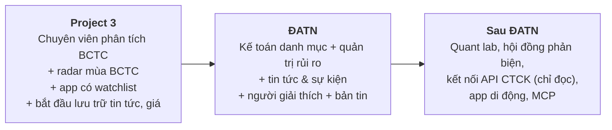

# Đích đến dài hạn: Đội ngũ đầu tư AI của riêng bạn

> Tài liệu này mô tả đích đến. Các tài liệu liên quan:
> - Lộ trình từng giai đoạn: [vision-and-roadmap.md](vision-and-roadmap.md)
> - Nhu cầu người dùng thực tế: [user-research.md](user-research.md)
> - Tin tức và giá cổ phiếu: [news-impact.md](news-impact.md)
> - Kiến thức nền về thị trường: [market-primer.md](market-primer.md)

## 1. Ý tưởng trong một đoạn

Một quỹ đầu tư chuyên nghiệp có cả một đội ngũ: chuyên viên phân tích, người theo dõi tin tức, kế toán danh mục, quản trị rủi ro. Nhà đầu tư cá nhân thì không có ai. **Soi là đội ngũ đó, bằng AI**, làm việc 24/7 quanh danh mục của bạn:
- đọc mọi BCTC và mọi công bố thông tin;
- giải thích vì sao giá biến động;
- tính đúng lãi/lỗ thật;
- cảnh báo rủi ro;
- giúp bạn học.

**Đội ngũ không quyết định thay bạn.** Việc của nó là giúp bạn không bỏ lỡ thông tin và không mắc những sai lầm có thể tránh được.

Đề tài "Stock Report Agent" chính là **thành viên đầu tiên** của đội ngũ: chuyên viên phân tích BCTC.

## 2. Đội ngũ gồm những ai

| Vai trò | Việc làm | Ví dụ đầu ra | Giai đoạn |
|---|---|---|---|
| **Chuyên viên phân tích BCTC** | Đọc và kiểm chứng BCTC, công văn giải trình, tài liệu ĐHCĐ | Thẻ KQKD, báo cáo so sánh có nguồn | **P3** (đề tài gốc) |
| **Chuyên viên tin tức & sự kiện** | Theo dõi công bố thông tin và tin tức; gom tin trùng; gắn đúng mã; chấm mức độ quan trọng | "Chủ tịch HĐQT đăng ký bán 1 triệu cổ phiếu từ 1/10" | P3 (chỉ BCTC) → **ĐATN** |
| **Kế toán danh mục** | Vị thế; **"giá vốn hai lớp"** (theo CTCK và vốn thực bỏ ra); cổ tức, cổ phiếu thưởng, quyền mua; phí; thuế; lãi/lỗ thật; so với VN-Index | "Giá vốn trên app CTCK 21.500đ, nhưng bạn thực bỏ ra 23.000đ và đã nhận 1.500đ cổ tức" | **ĐATN** |
| **Quản trị rủi ro** | Theo dõi tỷ trọng từng mã và từng ngành, thanh khoản, mức sụt giảm, margin; báo khi vi phạm quy tắc do bạn tự đặt | "HPG chiếm 45% danh mục, vượt ngưỡng 30% bạn đặt" | **ĐATN** |
| **Người giải thích** | Trả lời "vì sao danh mục biến động hôm nay?" | "70% mức giảm đến từ HPG: ngành thép giảm 3%, khối ngoại bán ròng" | **ĐATN** |
| **Thư ký** | Bản tin sáng, nhìn lại tuần, trả lời câu hỏi, dạy khái niệm khi bạn chưa hiểu | Bản tin 7:30 qua Zalo | **ĐATN** |
| **Nhà nghiên cứu định lượng** | Thống kê phản ứng giá sau các loại sự kiện; kiểm tra quy tắc trên dữ liệu lịch sử, có tính đủ phí, thuế, T+2 và biên độ | "Sau các lần công bố lãi tăng trên 30%, giá 5 phiên sau thường…" | ĐATN (thống kê) → sau |
| **Kiểm soát tuân thủ** | Chặn ngôn ngữ khuyến nghị, gắn nhãn nội dung AI, bảo vệ dữ liệu cá nhân | Chạy ngầm | Từ P3 |
| **Hội đồng phản biện** (chỉ dùng riêng) | Đưa luận điểm ủng hộ và phản đối, kèm dẫn chứng; ghi nhật ký quyết định | "3 điểm ủng hộ, 3 điểm rủi ro, nguồn đi kèm" | Sau ĐATN |

> Về kỹ thuật, mỗi vai trò là một agent (LLM + công cụ) hoặc một dịch vụ tính toán thuần. Chỉ dùng LLM ở chỗ cần hiểu ngôn ngữ. **Mọi con số đều do code tính.** Tất cả vai trò dùng chung một kho dữ liệu đã kiểm chứng.

## 3. Một ngày làm việc cùng đội ngũ (ví dụ minh họa)

- **7:30, bản tin sáng qua Zalo hoặc web:**
  - Hôm qua danh mục giảm 1,2%, VN-Index giảm 0,8%. Phần lớn mức giảm đến từ một mã, kèm lý do: cả ngành giảm, khối ngoại bán ròng.
  - Hôm nay là ngày GDKHQ cổ tức tiền mặt của một mã bạn đang giữ. Bạn sẽ nhận X đồng sau thuế 5% vào ngày Y. Giá tham chiếu hôm nay đã được điều chỉnh, nên mức giảm giá là "giả".
  - Một người nội bộ ở công ty bạn đang giữ vừa đăng ký bán cổ phiếu (kèm link văn bản gốc).
  - Lịch trong tuần: 2 mã trong danh mục dự kiến công bố BCTC quý.
- **Trong mùa BCTC:** mã nào trong danh mục vừa công bố là có ngay thẻ KQKD đã kiểm chứng, % hoàn thành kế hoạch năm, và nguyên nhân lấy từ công văn giải trình.
- **Bất cứ lúc nào, bạn hỏi đội ngũ:**
  - "So sánh ngân hàng A với B quý này."
  - "Danh mục của tôi đang dồn vào ngành nào?"
  - "Nếu bán một nửa mã X thì tỷ trọng các ngành thay đổi ra sao?" (mô phỏng, không phải khuyến nghị)
- **Cuối tuần:** hiệu suất so với VN-Index, các quyết định bạn đã ghi, và lịch sự kiện tuần tới.

## 4. Vì sao ChatGPT không thay được đội ngũ này

- **Không biết danh mục của bạn.** Mỗi lần hỏi lại phải kể lại từ đầu.
- **Không tự theo dõi thị trường.** Nó không báo khi công ty bạn đang giữ vừa công bố thông tin.
- **Không tính được giá vốn đúng** sau cổ tức bằng cổ phiếu hay quyền mua, nhất là khi bạn có tài khoản ở nhiều CTCK.
- **Không có dữ liệu Việt Nam đã kiểm chứng**, nên không chứng minh được con số.

→ Mọi thứ đội ngũ làm đều dựa trên **trạng thái** (danh mục, lịch sử, quy tắc bạn đặt) và **dữ liệu**. Một cuộc chat không có cả hai thứ này.

## 5. Ứng dụng riêng trước, MCP sau

Đồng ý với hướng **xây ứng dụng riêng trước**:
- **Quản lý danh mục cần một ứng dụng:** phải lưu trạng thái, có giao diện, có thông báo. MCP không làm được những việc đó.
- **ĐATN được đánh giá bằng người dùng của sản phẩm.** Người dùng đến thẳng ứng dụng thì dễ đo và dễ trình bày trước hội đồng hơn là lượt gọi qua ChatGPT.
- **Giữ được quan hệ với người dùng:** thương hiệu, phản hồi, dữ liệu hành vi, khả năng giữ chân.
- **Không phụ thuộc vào quy trình duyệt** app tài chính trên nền tảng của bên thứ ba.

**Cách làm để thêm MCP sau mà không phải viết lại:** thiết kế backend theo hướng **API-first**. Ứng dụng web, Zalo Bot và sau này là MCP đều chỉ là "vỏ" gọi chung một API. Khi cần, làm MCP chỉ mất 1–2 tuần.

## 6. Ranh giới: đội ngũ làm gì và không làm gì

| Làm (với mọi người dùng) | Không làm (khi chưa có giấy phép) |
|---|---|
| Thông tin, số liệu đã công bố, có nguồn | Khuyến nghị mua / bán / nắm giữ |
| Phân tích, thống kê, giải thích | Giá mục tiêu, "tín hiệu" mua bán |
| Công cụ để bạn tự ghi chép và theo dõi danh mục của chính mình | Quản lý tiền hoặc danh mục của người khác |
| Cảnh báo theo **quy tắc do người dùng tự đặt** | Tự đặt lệnh thay người dùng |
| Mô phỏng "nếu… thì…", giáo dục | Cam kết lợi nhuận |

**Dùng riêng cho bạn** (không công bố cho người khác): có thể thử thêm hội đồng phản biện và các tín hiệu thử nghiệm. Nên **giao dịch giấy (paper trading) trước** rồi mới dùng tiền thật.

## 7. Kỳ vọng thực tế

- **AI không làm bạn giàu nhanh.** Phần lớn các chiến lược "đánh bại thị trường" thất bại sau khi trừ phí và thuế. Các chiến lược tìm được trên dữ liệu quá khứ thường không còn hiệu quả khi áp dụng thật.
- **Giá trị thật của đội ngũ nằm ở:**
  - tiết kiệm thời gian;
  - không bỏ lỡ thông tin quan trọng;
  - tránh sai lầm: đọc sai BCTC, tin theo tin đồn, dồn quá nhiều tiền vào một mã, quên sự kiện quyền;
  - giữ kỷ luật;
  - học hỏi.
- **Bạn là người dùng đầu tiên.** Hãy dùng sản phẩm của mình mỗi ngày với một danh mục nhỏ hoặc danh mục giả lập. Đây là cách nhanh nhất để hiểu thị trường và hiểu người dùng.

## 8. Lộ trình tới đích

