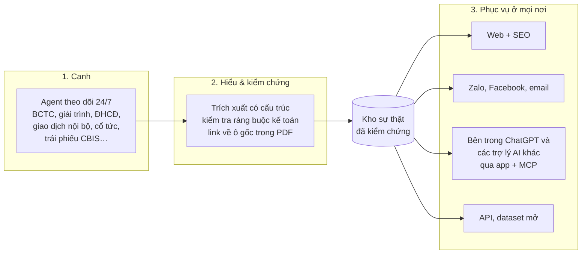
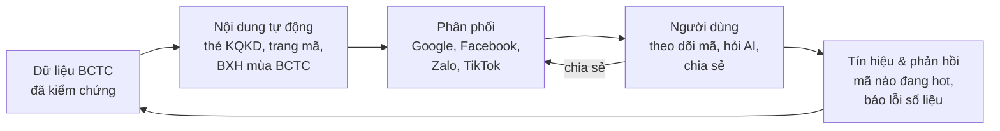
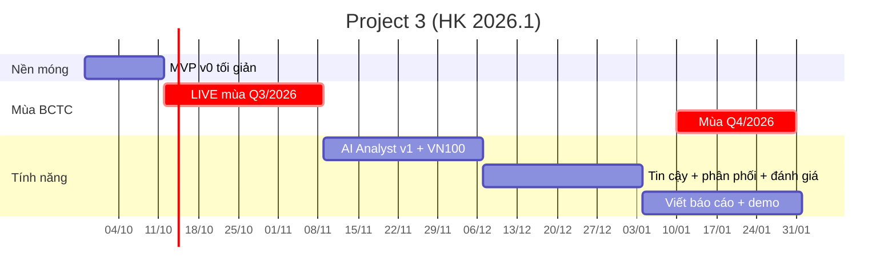

# Stock Report Agent → Sản phẩm thật: Ý tưởng lớn & Lộ trình (Project 3 → ĐATN)

> Tài liệu định hướng cho đề tài *"Ứng dụng Agentic AI trong Chứng khoán: Stock Report Agent"*.
> Hướng đi: **ứng dụng**. Sản phẩm phải triển khai thật, có người dùng thật; lưu lượng người dùng là thước đo chính.
> Cập nhật: 26/09/2026. Tài liệu kỹ thuật đi kèm: [architecture.md](architecture.md)

## Mục lục

0. [Tóm tắt](#0-tóm-tắt)
1. [Câu hỏi chốt: tại sao không hỏi thẳng ChatGPT?](#1-câu-hỏi-chốt-tại-sao-không-hỏi-thẳng-chatgpt)
2. [Đề bài & di sản của khóa trước](#2-đề-bài--di-sản-của-khóa-trước)
3. [Bối cảnh 09/2026: thị trường, quy định, đối thủ, kênh, pháp lý](#3-bối-cảnh-092026-thị-trường-quy-định-đối-thủ-kênh-pháp-lý)
4. [Năm nhận định chiến lược](#4-năm-nhận-định-chiến-lược)
5. [Tầm nhìn sản phẩm: vượt khỏi "Stock Report"](#5-tầm-nhìn-sản-phẩm-vượt-khỏi-stock-report)
6. [Kho ý tưởng lớn](#6-kho-ý-tưởng-lớn)
7. [Chọn chiến lược](#7-chọn-chiến-lược-kết-hợp-theo-thứ-tự)
8. [Project 3: MVP có người dùng thật](#8-project-3-mvp-có-người-dùng-thật)
9. [ĐATN: lớn hơn theo 4 trục](#9-đatn-lớn-hơn-theo-4-trục)
10. [Đo lường & bằng chứng cho hội đồng](#10-đo-lường--bằng-chứng-cho-hội-đồng)
11. [Rủi ro & cách giảm thiểu](#11-rủi-ro--cách-giảm-thiểu)
12. [Việc cần làm ngay & câu hỏi cho GVHD](#12-việc-cần-làm-ngay--câu-hỏi-cho-gvhd)

---

## 0. Tóm tắt

- **Đề bài** gồm 5 bước: nhận yêu cầu → lập kế hoạch → thu thập → phân tích và so sánh → tạo báo cáo có bảng, biểu đồ. Dữ liệu trích xuất được lưu vào CSDL.
- **Khóa trước** (repo `buinguyenkhai/stock-report-agent-20251`):
  - Làm rất sâu phần OCR (Hybrid Tesseract + Surya).
  - **Chưa làm bước 4–5 và CSDL.**
  - Mỗi truy vấn mất ~5 phút, cần GPU, chạy Streamlit trên máy cá nhân.
  - Chỉ lưu cột "kỳ này" nên **không so được với cùng kỳ**.
  - → Nền tảng tốt để học, nhưng không thể có người dùng thật.
- **Câu hỏi chốt: tại sao không hỏi thẳng ChatGPT?** Nếu sản phẩm chỉ là một chatbot, hay một máy tạo báo cáo khi được hỏi, thì **không có lý do gì**: ChatGPT làm được, miễn phí, và OpenAI vừa ra hẳn một bản cho ngành tài chính. Sản phẩm chỉ đáng tồn tại ở 4 chỗ mà về bản chất ChatGPT không làm được (xem [mục 1](#1-câu-hỏi-chốt-tại-sao-không-hỏi-thẳng-chatgpt)):
  - **Canh thị trường ngay cả khi người dùng không hỏi.** ChatGPT chỉ trả lời khi được hỏi.
  - **Sở hữu dữ liệu đã chuẩn hóa cho toàn thị trường.** ChatGPT chỉ đi tìm lúc được hỏi.
  - **Chứng minh được từng con số.** Các mô hình tốt nhất vẫn sai khoảng 30–40% trên bài kiểm tra công việc của chuyên viên phân tích.
  - **Là nơi làm việc, biết danh mục của bạn**, có trạng thái và cộng đồng. ChatGPT chỉ là một ô trống.
  - **Ứng dụng riêng là "nhà" của sản phẩm.** MCP, tức cách để ChatGPT và các trợ lý AI khác gọi được dữ liệu của Soi, là kênh phụ và sẽ thêm sau. Backend được thiết kế API-first nên khi đó sẽ không phải viết lại.
- **Đổi tư duy:** không đợi người dùng hỏi rồi mới đi tải và OCR PDF. Hãy **đọc mọi công bố thông tin một lần ngay khi nó xuất hiện, tự kiểm chứng rồi lưu vào CSDL**, để phục vụ hàng nghìn người, mỗi người chỉ chờ vài giây.
- **Tầm nhìn vượt khỏi "Stock Report"** (tên tạm **"Soi"**): **đội ngũ đầu tư AI của riêng bạn, làm việc quanh danh mục của bạn** (xem [north-star.md](north-star.md)).
  - Nền móng là *lớp sự thật thời gian thực của thị trường vốn Việt Nam*: mọi công bố thông tin (BCTC, giao dịch nội bộ, cổ tức, ĐHCĐ…) được AI đọc, kiểm chứng và giải thích trong vài phút.
  - Trên nền đó là các "thành viên" của đội ngũ:
    - chuyên viên phân tích BCTC (chính là đề tài gốc);
    - chuyên viên tin tức và sự kiện;
    - kế toán danh mục;
    - quản trị rủi ro;
    - người giải thích "vì sao giá biến động";
    - thư ký soạn bản tin mỗi sáng.
  - Đội ngũ **cung cấp thông tin và phân tích, không quyết định thay người dùng**.
  - BCTC là điểm bắt đầu, vì đó là phần khó nhất và giá trị nhất.
- **Bối cảnh 09/2026:**
  - ~13,9 triệu tài khoản chứng khoán.
  - FTSE nâng hạng Việt Nam, có hiệu lực từ 21/9/2026.
  - "AI chứng khoán" đã đông: FireAnt, Simplize, VPBankS, DNSE, MBS, TCBS… đều có trợ lý AI. Ngày 10/9/2026 OpenAI ra ChatGPT for Financial Services (bản doanh nghiệp, dành cho ngân hàng đầu tư).
  - Nhưng các trợ lý này chủ yếu **hỏi–đáp bị động**, gắn với tài khoản CTCK hoặc thu phí. Hiếm sản phẩm trích nguồn đến từng con số. Chưa thấy ai **tự động phân tích ngay khi BCTC vừa ra**. Đó là khoảng trống ta nhắm vào.
- **5 cược lớn:**
  - ① Radar mọi công bố thông tin, bắt đầu từ BCTC.
  - ② Số liệu tự kiểm chứng, bấm vào là xem được nguồn.
  - ③ **Danh mục là trung tâm:**
    - giá vốn đúng sau các sự kiện quyền (cổ tức, cổ phiếu thưởng, quyền mua);
    - lãi thật sau phí và thuế;
    - cảnh báo rủi ro;
    - trả lời "vì sao danh mục biến động hôm nay".
  - ④ Có mặt ở nơi người dùng đang ở: **ứng dụng riêng** (web), Zalo, Facebook, Google. MCP thêm sau.
  - ⑤ AI Analyst, cộng đồng và niềm tin: kiểm chứng tin đồn, công bố độ chính xác sau mỗi mùa BCTC.
- **Thời điểm vàng:** mùa BCTC quý 3/2026 rơi đúng học kỳ Project 3.
  - Lác đác từ ~10/10, đỉnh quanh **20/10** và **30/10**.
  - Launch bản nhỏ (VN30 + ngân hàng) trước ~12/10.
  - Đến lúc bảo vệ ĐATN, sản phẩm đã qua 4 mùa BCTC và mùa ĐHCĐ, tích lũy được SEO và cộng đồng.
- **Project 3** = MVP có người dùng thật, gồm:
  - chuyên viên phân tích BCTC (VN30 → VN100);
  - radar mùa BCTC;
  - web có watchlist, Facebook, Zalo;
  - **bắt đầu lưu trữ tin tức, giá và giờ công bố ngay từ bây giờ**, vì dữ liệu này không thu lại được về sau.
- **ĐATN** = đội ngũ AI quanh danh mục, gồm:
  - kế toán danh mục và quản trị rủi ro;
  - chuyên viên tin tức và sự kiện;
  - người giải thích "vì sao giá biến động";
  - bản tin mỗi sáng.

  Chạy trên dữ liệu toàn thị trường và vận hành như một sản phẩm thật, có số liệu tăng trưởng và giữ chân người dùng để chứng minh.
- **Ranh giới pháp lý:** sản phẩm là **dịch vụ thông tin**, không phải tư vấn đầu tư. Không khuyến nghị mua/bán, không đưa giá mục tiêu (xem [3.5](#35-pháp-lý-cần-biết-ngay-từ-đầu)).

---

## 1. Câu hỏi chốt: tại sao không hỏi thẳng ChatGPT?

### 1.1 Trả lời thẳng

Nếu sản phẩm chỉ là *"chatbot hỏi gì đáp nấy về chứng khoán"* hoặc *"máy tạo báo cáo khi được hỏi"*, thì **không có lý do nào** để người dùng chọn nó thay cho ChatGPT:
- ChatGPT miễn phí, quen thuộc, có khoảng 1 tỷ người dùng mỗi tháng và được cải thiện hằng tháng.
- Nhà đầu tư Việt đã quen hỏi ChatGPT về cổ phiếu.
- Từ 10/9/2026, OpenAI còn có hẳn *ChatGPT for Financial Services*.

Một sản phẩm của sinh viên không thể thắng ChatGPT ở chuyện "trả lời hay".

→ Sản phẩm chỉ đáng tồn tại ở những chỗ ChatGPT **về bản chất** không làm được. Không tính những chỗ nó "hiện làm chưa tốt", vì mô hình đời sau sẽ tự lấp.

### 1.2 Bốn điều mà về bản chất ChatGPT không làm được

**① ChatGPT chỉ trả lời khi được hỏi. Soi canh thị trường cả khi bạn không hỏi.**
- **ChatGPT:** tính năng chủ động Pulse đã bị khai tử vào 6/2026. Thứ thay thế là Scheduled Tasks: chạy theo lịch, dựa trên tìm kiếm web chung, chỉ có ở bản trả phí.
- **Soi:** agent chạy 24/7. BCTC hay công bố thông tin vừa lên cổng là được đọc, kiểm chứng, rồi báo cho đúng người đang theo dõi mã đó trong vòng vài phút.
- **Vì sao là bản chất:** một trợ lý đa năng phục vụ cả tỷ người sẽ không duy trì một bộ canh chuyên biệt cho các cổng công bố thông tin của Việt Nam.

**② ChatGPT không có dữ liệu, nó chỉ đi tìm lúc được hỏi. Soi có sẵn CSDL.**
- **ChatGPT:** đọc tin tức và trang web ngay lúc bạn hỏi.
- **Soi:** có CSDL BCTC và sự kiện đã chuẩn hóa cho toàn thị trường, nhiều năm. Nhờ vậy trả lời được câu hỏi trên toàn thị trường, lập bảng xếp hạng, lọc cổ phiếu.
- **Vì sao là bản chất:** dữ liệu là tài sản được pipeline tích lũy dần theo thời gian, không thể sinh ra trong một cuộc chat. Chính OpenAI cũng phải tích hợp dữ liệu từ LSEG, Daloopa, Quartr… cho bản tài chính, và bản đó dành cho ngân hàng đầu tư chứ không phải nhà đầu tư cá nhân Việt Nam.

**③ ChatGPT không chứng minh được con số. Soi thì chứng minh được.**
- **ChatGPT:** trên bài kiểm tra công việc của chuyên viên phân tích với hồ sơ tiếng Anh của Mỹ, các mô hình tốt nhất mới đúng khoảng 60–70% (Vals AI Finance Agent v2, 9/2026).
- **Soi:** mỗi con số đều qua phương trình kế toán, bấm vào là thấy ô gốc trong PDF. Sau mỗi mùa BCTC, Soi công bố tỷ lệ chính xác.
- **Vì sao là bản chất:** BCTC Việt Nam khó hơn nhiều. Phần lớn là bản scan. Mã số đổi theo TT99 từ năm 2026. Khoảng 1/4 BCTC dùng dấu phẩy phân tách hàng nghìn. Đơn vị có khi là đồng, có khi là triệu đồng. Còn phải phân biệt hợp nhất với riêng lẻ, quý với lũy kế. Kiểm chứng được những thứ này cần tri thức chuyên biệt về mẫu biểu.

**④ ChatGPT là một ô trống. Soi là nơi làm việc.**
- **ChatGPT:** người dùng phải biết hỏi gì, và mỗi lần hỏi lại bắt đầu từ đầu.
- **Soi:** có watchlist, lịch sự kiện, cảnh báo, lịch sử, thẻ chia sẻ, cộng đồng dự đoán, cuộc thi.
- **Vì sao là bản chất:** trạng thái và cộng đồng không thể nằm trong một câu trả lời.

**Chi phí thực tế của người dùng** (ước tính): để có kết quả tương đương bằng ChatGPT, bạn phải tự tìm PDF, tải lên (bản scan nặng 6–24 MB), hỏi đúng câu, tự kiểm tra lại số, rồi lặp lại cho từng mã, từng quý. Với một danh mục 10 mã trong mùa BCTC, việc đó tốn hàng giờ. Với Soi thì không tốn phút nào, vì thông báo tự đến.

### 1.3 Ứng dụng riêng là "nhà", ChatGPT là một kênh phụ về sau

**Quyết định (27/09/2026): xây ứng dụng riêng trước, MCP để sau.** Lý do:
- **Tính năng trung tâm cần ứng dụng riêng.** Danh mục, cảnh báo, bản tin, lịch sự kiện đều cần lưu trạng thái, có giao diện và gửi thông báo. MCP không làm được những việc này.
- **ĐATN chấm theo người dùng của sản phẩm.** Người dùng vào thẳng ứng dụng thì dễ đo và dễ trình bày hơn.
- **Giữ được quan hệ với người dùng:** thương hiệu, phản hồi, dữ liệu hành vi.
- **Không phụ thuộc vào việc duyệt** app tài chính trên nền tảng của bên thứ ba.

**Vẫn giữ cửa cho MCP.** Backend thiết kế **API-first**: web, Zalo Bot và sau này là MCP đều chỉ là "vỏ" gọi chung một API. Khi cần thì thêm MCP, mất khoảng 1–2 tuần.
- **Cơ hội sau này:** ChatGPT đã mở thư mục ứng dụng từ 12/2025 (Apps SDK, xây trên MCP).
- **Khác biệt so với MCP hiện có:** TCBS và Finhay đã có MCP, nhưng gắn với tài khoản của họ. Soi thì trung lập, có kiểm chứng và dẫn nguồn.
- **Hình mẫu:** *Daloopa*, công ty chuyên trích số liệu từ BCTC mà mỗi con số đều có link về nguồn, là một nguồn dữ liệu của ChatGPT for Financial Services.

### 1.4 Câu trả lời một dòng

> **"ChatGPT biết nói. Soi biết đúng, biết trước, biết danh mục của bạn, và chứng minh được từng con số."**

### 1.5 Đừng tin lời, hãy đo: "ChatGPT test"

Xây bộ kiểm tra ngay trong tuần 2–4 của P3, rồi lặp lại sau mỗi mùa BCTC (vì mô hình liên tục tiến bộ).

**Bộ câu hỏi:** 50–100 câu hỏi thật, chia 5 loại.

| Loại câu hỏi | Ví dụ |
|---|---|
| Tra số | "LNST của cổ đông công ty mẹ quý 2/2026 của X là bao nhiêu?" |
| So sánh | "So với cùng kỳ thì sao? So với Y thì sao?" |
| Toàn thị trường | "5 ngân hàng nào có lợi nhuận quý 2/2026 tăng mạnh nhất?" |
| Độ mới | Hỏi trong vòng 1 giờ sau khi doanh nghiệp công bố BCTC quý 3/2026 |
| Đặc thù Việt Nam | "Đã hoàn thành bao nhiêu % kế hoạch năm? Nguyên nhân theo công văn giải trình là gì?" |

**Đối tượng so sánh:** ChatGPT (có tìm kiếm web), Gemini, Perplexity, và Soi.

**Thước đo:**
- Tỷ lệ đúng số (sai số không quá 0,5%).
- Trả lời đủ hay thiếu.
- Thời gian trả lời.
- Nguồn có kiểm chứng được không.
- Chi phí.

**Quy tắc:** loại câu hỏi nào ChatGPT đã đúng từ 95% trở lên thì **đó không phải lý do để sản phẩm tồn tại**. Bỏ hoặc hạ ưu tiên tính năng tương ứng.

**Kết quả dùng để:** làm chương đánh giá của báo cáo P3 và ĐATN, đồng thời là câu trả lời có số liệu cho hội đồng.

### 1.6 Quy tắc chọn tính năng từ nay

> Nếu người dùng có thể có kết quả tương đương trong ChatGPT **dưới 1 phút** và **tin cậy ngang như vậy**, thì **không làm**, hoặc chỉ làm như một tính năng phụ trên nền dữ liệu.

Ma trận ý tưởng ở [mục 6](#ma-trận-ưu-tiên) có thêm cột "Qua ChatGPT test?".

Nguồn cho mục 1

- ChatGPT đạt 1 tỷ người dùng mỗi tháng: https://www.vietnamplus.vn/chatgpt-can-moc-1-ty-nguoi-dung-hang-thang-bat-chap-nhung-lo-ngai-ve-ai-post1116212.vnp
- Nhà đầu tư dùng ChatGPT để mua chứng khoán: https://thanhnien.vn/xu-huong-nha-dau-tu-su-dung-chatgpt-de-mua-chung-khoan-185250925193036272.htm
- ChatGPT for Financial Services (10/9/2026): https://vtv.vn/openai-tung-phien-ban-chatgpt-chuyen-biet-cho-nganh-tai-chinh-100260911162446893.htm
- Vals AI, Finance Agent v2: https://www.vals.ai/benchmarks/fabv2
- ChatGPT Pulse bị khai tử, thay bằng Scheduled Tasks: https://justinmckelvey.com/blog/chatgpt-pulse
- Thư mục ứng dụng ChatGPT (Apps SDK/MCP): https://openai.com/index/developers-can-now-submit-apps-to-chatgpt/
- TCBS MCP Server: https://help.tcbs.com.vn/tcbs-mcp-server/

---

## 2. Đề bài & di sản của khóa trước

### 2.1 Đề bài thực sự đòi hỏi gì

| Bước trong đề bài | Hiểu theo góc nhìn sản phẩm |
|---|---|
| 1. Nhận đầu vào: danh sách mã + yêu cầu ("so sánh KQKD Q1/2024 của VCB và TCB", "Q3/2025 so với cùng kỳ") | Hiểu tiếng Việt tự nhiên; nhiều mã, nhiều kỳ, nhiều kiểu so sánh |
| 2. Lập kế hoạch: xác định nguồn tin cậy, chiến lược thu thập | Agent tự quyết cần dữ liệu gì, CSDL đã có chưa, nếu thiếu thì lấy ở đâu |
| 3. Thu thập: web scraper, PDF, bảng biểu | Pipeline đọc PDF (kể cả bản scan) chính xác đến từng con số |
| 4. Phân tích & tóm tắt: "doanh thu VCB +15% so với cùng kỳ, TCB chỉ +10%" | So sánh YoY, QoQ, lũy kế, giữa các công ty; có giải thích nguyên nhân |
| 5. Tạo báo cáo: văn bản + bảng + biểu đồ | Báo cáo đẹp, chia sẻ được, xuất được PDF hoặc ảnh |
| Lưu dữ liệu vào CSDL cho nghiệp vụ chuyên sâu | Kho BCTC có cấu trúc, làm nền cho mọi tính năng sau này |

> Ví dụ trong đề (VCB, TCB) là **ngân hàng**. Mẫu BCTC ngân hàng khác hẳn doanh nghiệp thường (thu nhập lãi thuần, dự phòng rủi ro tín dụng, …) nên phải xử lý riêng ngay từ đầu.

### 2.2 Khóa trước đã làm được gì

| Hạng mục | Trạng thái | Ghi chú |
|---|---|---|
| Hiểu truy vấn tiếng Việt → `ReportRequest` | ✅ | Few-shot; lọc bỏ báo cáo của kỳ chưa tới |
| Tìm link PDF trên Vietstock | ✅ | Gọi endpoint danh sách tài liệu, không dùng LLM (nhanh, rẻ) |
| OCR lai Tesseract + Surya | ✅ **đóng góp chính** | Number F1: 85,3% (Hybrid), 81,6% (Tesseract), 87,8% (Marker); 11,1 s/trang |
| Trích 3 báo cáo chính → JSON | ⚠️ một phần | Mỗi chỉ tiêu chỉ lưu **1 giá trị** ("kỳ này"), mất cột cùng kỳ năm trước và cột lũy kế, nên không so YoY được |
| Bước 4: phân tích, so sánh | ❌ | `generate_final_response` chỉ liệt kê link tìm được |
| Bước 5: báo cáo có nhận định và biểu đồ | ⚠️ | Chỉ hiển thị bảng và export CSV/Excel/JSON; không có nhận định, không có biểu đồ |
| Nhiều báo cáo trong 1 truy vấn, so sánh 2 mã | ❌ | Giới hạn 1 báo cáo mỗi truy vấn |
| Lưu CSDL | ❌ | Có `schema.sql` (PostgreSQL + pgvector) nhưng code không dùng tới |
| Triển khai cho người dùng | ❌ | Streamlit chạy local, cần GPU, mất ~5 phút và ~$0,04 cho mỗi báo cáo |

Điểm nên học:
- Phần OCR được đánh giá định lượng bài bản: dataset 401 trang của 9 công ty, dùng CER, Word Recall và Number F1.
- Kiến trúc LangGraph rõ ràng.
- Lấy link PDF mà không cần LLM.

### 2.3 Vì sao kiến trúc cũ không thể có "lưu lượng người dùng"

1. **Xử lý theo từng truy vấn.** 100 người cùng hỏi "FPT quý 3" nghĩa là 100 lần OCR giống hệt nhau, mỗi lần ~5 phút.
2. **Phụ thuộc GPU** (Surya). Chi phí server cao, không phục vụ được nhiều người cùng lúc.
3. **Thiếu dữ liệu để so sánh.** Chỉ lưu 1 giá trị cho mỗi chỉ tiêu, trong khi BCTC quý có sẵn cột "cùng kỳ năm trước" và "lũy kế". Vì vậy hệ thống không trả lời được câu hỏi cốt lõi của đề bài.
4. **Không có bước kiểm chứng.** Number F1 ~85% nghĩa là vẫn còn đáng kể số bị đọc sai hoặc bỏ sót, và lỗi đó đến thẳng tay người dùng. Trong tài chính, một con số sai là mất niềm tin.
5. **Streamlit chạy local.** Không làm SEO được, khó chia sẻ, khó dùng trên di động, khó phục vụ nhiều người.
6. **Không có kênh tiếp cận.** Người dùng phải tự biết đến và tự tìm vào.
7. **Giả định cứng về định dạng đã lỗi thời.**
   - Báo cáo khóa trước coi số kiểu châu Âu (`1.234.567`) là quy ước chung, và định nghĩa hằng số "tổng tài sản = mã 270" theo Thông tư 200.
   - Rà 941 BCTC Q2/2026 cho thấy: khoảng 1/4 BCTC viết `1,234,567`, và **từ Q1/2026 Thông tư 99/2025 đã đổi mã tổng tài sản thành 280** (xem [3.2](#32-quy-định-công-bố-thông-tin--lịch-của-sản-phẩm)).

### 2.4 Kế thừa gì (repo dùng giấy phép MIT, cần giữ ghi công)

- **Logic lấy danh sách tài liệu Vietstock** (`nodes/extract_link.py`): làm nguồn đầu tiên cho module "canh" BCTC mới.
- **Bộ benchmark OCR** (`evaluation/ocr_benchmark`) và dataset vnpdf: làm **baseline định lượng**. Chạy pipeline mới trên cùng dữ liệu, cùng thước đo để chứng minh cải thiện so với Hybrid OCR.
- **Hybrid OCR**: phương án dự phòng cho bản scan khó (tùy chọn, vì cần GPU).
- **Tri thức miền**: định dạng số, quy đổi đơn vị, mã số chỉ tiêu, các prompt trích xuất. Phần mã số phải cập nhật theo TT99.

> **Một dự án công khai khác nên xem:** [`hoangxin/Loc_BCTC_Mistral`](https://github.com/hoangxin/loc_bctc_mistral) (Next.js + Mistral OCR).
> - Tải BCTC từ API nội bộ của Vietstock.
> - Xử lý nhiều định dạng file: PDF, DOCX, ZIP, RAR.
> - Có kho khoảng 1.000 BCTC Q2/2026 đã OCR, hữu ích để thử nghiệm nhanh.
>
> Repo chưa ghi giấy phép, nên chỉ tham khảo ý tưởng. Đừng sao chép code hoặc dữ liệu khi chưa được phép.

---

## 3. Bối cảnh 09/2026: thị trường, quy định, đối thủ, kênh, pháp lý

> Số liệu tra cứu cuối 09/2026, chủ yếu qua báo chí và trang chính thức (nguồn ở cuối mục). Nên kiểm tra lại trước khi đưa vào báo cáo.

### 3.1 Thị trường

| Chỉ số | Giá trị | Ghi chú |
|---|---|---|
| Tài khoản chứng khoán | **~13,89 triệu** (31/8/2026, VSDC) | Đây là số tài khoản, không phải số người. Tăng ~2 triệu từ đầu năm 2026 |
| Tỷ trọng giao dịch của nhà đầu tư cá nhân | ~80–85% (báo chí), có thời điểm >90% | Chưa thấy số liệu chính thức năm 2026 |
| Số mã | HOSE ~405, HNX ~301, UPCoM ~825 (tổng ≈1.530) | Mùa Q3/2025 Vietstock theo dõi 1.644 doanh nghiệp (tùy cách đếm) |
| Nâng hạng | FTSE Russell: *Secondary Emerging* **có hiệu lực 21/9/2026**. 27 cổ phiếu vào FTSE All-Cap, tỷ trọng tăng dần theo lộ trình đến 9/2027 | MSCI vẫn xếp Việt Nam vào *Frontier* (6/2026) |

**Ý nghĩa:**
- Tệp nhà đầu tư cá nhân rất lớn và vẫn đang tăng.
- Sự quan tâm của nhà đầu tư nước ngoài tăng dần theo lộ trình FTSE.
- Cả hai nhóm đều cần thông tin nhanh, đáng tin, và có bản tiếng Anh.

### 3.2 Quy định công bố thông tin → "lịch" của sản phẩm

**Hạn công bố BCTC:**
- **BCTC quý:** trong vòng 20 ngày sau khi kết thúc quý. Riêng công ty mẹ lập BCTC hợp nhất được 30 ngày. Vì vậy mùa Q3/2026 có **2 đỉnh: ~20/10 và ~30/10**.
- **BCTC bán niên đã soát xét:** không quá 45 ngày sau 30/6.
- **BCTC năm đã kiểm toán:** không quá 90 ngày sau khi kết thúc năm tài chính.

**Bắt buộc giải trình khi:**
- LNST biến động từ 10% trở lên so với cùng kỳ;
- doanh nghiệp bị lỗ, hoặc chuyển từ lãi sang lỗ (hay ngược lại);
- chênh lệch trước và sau kiểm toán từ 5% trở lên.

Đây là nguồn dữ liệu cho phần "vì sao" (A4) và "sau kiểm toán" (A7).

**Công bố bằng tiếng Anh:**
- Tổ chức niêm yết và công ty đại chúng quy mô lớn phải công bố báo cáo định kỳ bằng tiếng Anh **từ 1/1/2025**. Nếu hai bản khác nhau thì bản tiếng Việt có giá trị pháp lý.
- Các công ty đại chúng còn lại áp dụng từ năm 2027.

**Kênh công bố:**
- Doanh nghiệp công bố một cửa qua Sở GDCK (HNX từ 3/2024, HOSE từ 8/2024).
- Dữ liệu đổ về hệ thống IDS của UBCKNN (`congbothongtin.ssc.gov.vn`).
- **Chưa có API công khai chính thức**, nên vẫn phải tự thu thập.

**Chế độ kế toán mới, áp dụng từ năm 2026:**
- **Thông tư 99/2025/TT-BTC** thay Thông tư 200/2014, hiệu lực 1/1/2026. Doanh nghiệp niêm yết áp dụng từ **BCTC Q1/2026**.
- Một số mã số bị đổi. Ví dụ tổng tài sản chuyển **270 → 280**. Trên KQKD có thêm mã 21, nên các mã tài chính dịch từ 21–23 thành 22–24.
- Thông tư 202 (BCTC hợp nhất) được sửa đổi bởi TT43/2026.
- Ngân hàng, CTCK và bảo hiểm tiếp tục dùng mẫu riêng.
- Rà 941 BCTC Q2/2026: ~88% đã ghi mã 280, ~11% vẫn ghi 270; khoảng 1/4 dùng dấu phẩy để phân tách hàng nghìn.
- → Hệ thống phải xử lý **song song nhiều mẫu và phiên bản**: TT200 cho dữ liệu lịch sử, TT99 cho dữ liệu mới, cộng thêm các ngành đặc thù. Xem chi tiết ở [architecture.md, mục 4.2](architecture.md#42-bộ-ràng-buộc-kiểm-chứng-khai-báo-theo-mẫu-và-phiên-bản).

**Nhịp thực tế mùa Q3/2025:**
- Lác đác từ ~9/10. Ngân hàng đầu tiên công bố ~14/10.
- Sóng thứ nhất 17–21/10.
- Sóng lớn nhất đúng hạn chót 30/10 (VCB, VNM, HVN…).
- Đến 5/11 đã có 1.107/1.644 doanh nghiệp công bố.

**Ngoài BCTC còn rất nhiều công bố thông tin "biết trước là có lợi"** (nguyên liệu cho [mục 6, nhóm D](#d-vượt-khỏi-bctc-radar-mọi-công-bố-thông-tin)):
- **Giao dịch của người nội bộ** và người có liên quan:
  - Phải đăng ký trước ngày giao dịch **ít nhất 3 ngày làm việc** khi giá trị dự kiến từ 50 triệu đồng/ngày hoặc 200 triệu đồng/tháng trở lên (theo mệnh giá).
  - Thời gian giao dịch không quá 30 ngày.
  - Phải báo cáo kết quả trong vòng 5 ngày làm việc.
- **Các sự kiện khác:** cổ tức và ngày chốt quyền, nghị quyết ĐHCĐ/HĐQT, phát hành thêm, thay đổi nhân sự chủ chốt, cổ đông lớn, xử phạt, ý kiến kiểm toán…
- **Trái phiếu doanh nghiệp:** cổng CBIS của HNX (`cbonds.hnx.vn`) công bố thông tin phát hành và tình hình thanh toán gốc, lãi, kể cả các trường hợp chậm trả.

### 3.3 Đối thủ: "AI chứng khoán" đã đông nhưng còn khoảng trống

| Nhóm | Ví dụ | Đang làm gì |
|---|---|---|
| Nền tảng dữ liệu và tin tức | Vietstock, CafeF, WiChart | Dữ liệu, biểu đồ, tin tức. CafeF dùng AI để tóm tắt tin |
| Nền tảng đầu tư có AI | FireAnt Copilot (thu phí, từ ~399k/tháng), Simplize Nebula AI, 24HMoney M.AI, Finpath, Index AI (7/2026, tóm tắt BCTC và BCTN) | Hỏi–đáp, tóm tắt, cảnh báo, tín hiệu |
| Công ty chứng khoán | VPBankS StockGuru ("agentic", báo cáo trong 20–30 giây), MBS Dolphin AI, DNSE ENSA (~1,2 triệu câu hỏi/năm), TCBS (Mập Thông Thái, MCP server), Finhay MCP, VNDirect | Trợ lý AI gắn với tài khoản và khách hàng của từng CTCK |
| **Trợ lý AI đa năng** (đối thủ thật sự, xem [mục 1](#1-câu-hỏi-chốt-tại-sao-không-hỏi-thẳng-chatgpt)) | ChatGPT (~1 tỷ người dùng/tháng); ChatGPT for Financial Services (10/9/2026, tích hợp LSEG, PitchBook, Daloopa, Crunchbase, Quartr; dành cho ngân hàng đầu tư); Gemini; Perplexity Finance | Trả lời mọi câu hỏi, tìm web, đọc PDF người dùng tải lên. Tính năng chủ động Pulse bị khai tử 6/2026, thay bằng Scheduled Tasks (bản trả phí). Có thư mục ứng dụng (Apps SDK/MCP) cho bên thứ ba |

**Khoảng trống** (suy ra từ marketing và báo chí, chưa dùng thử trực tiếp):
1. **Bị động.** Hầu hết chỉ là hỏi–đáp. Chưa thấy sản phẩm nào *tự động* đăng phân tích ngay khi BCTC vừa công bố.
2. **Khó kiểm chứng.** Hiếm ai quảng bá việc trích nguồn đến từng dòng, từng ô hay kiểm chứng số liệu. Trong khi đó, chính người trong ngành thừa nhận *"AI rất dễ bịa trong tài chính"* và coi chuẩn hóa dữ liệu là nút thắt.
3. **Bị khóa.** Nhiều trợ lý chỉ dùng được với tài khoản của một CTCK, hoặc phải trả phí.
4. **Thiếu chiều sâu đặc thù Việt Nam.** Chưa thấy ai làm tự động và có nguồn các mục: % kế hoạch ĐHCĐ, nguyên nhân lấy từ công văn giải trình, chênh lệch sau kiểm toán.
5. **Phân phối chỉ qua chat trong app.** Ít ai dùng SEO, thẻ chia sẻ hay Zalo như một kênh nội dung.

6. **Không ai làm lớp dữ liệu trung lập cho AI.** Dữ liệu dạng MCP hiện có đều gắn với tài khoản của một CTCK. Chưa có nguồn mở nào mà ChatGPT và các trợ lý AI khác gọi được để lấy số liệu BCTC Việt Nam đã kiểm chứng, kèm link về nguồn.

**→ Định vị của ta:** *chủ động (radar) + kiểm chứng được (có nguồn cho từng con số) + trung lập và miễn phí + đặc thù Việt Nam + có mặt ở mọi nơi, kể cả bên trong ChatGPT.* Ta **không** cạnh tranh ở mảng "chatbot hỏi gì cũng trả lời".

**Tham khảo lưu lượng** (ước tính Semrush/Similarweb, lượt truy cập mỗi tháng): CafeF ~10 triệu, FireAnt ~3,5–5,4 triệu, Vietstock ~3,5 triệu, Simplize ~0,3 triệu. Nhu cầu thông tin tài chính rất lớn, nên một sản phẩm ngách chỉ cần chiếm phần nhỏ cũng đã có lưu lượng đáng kể.

**Sản phẩm quốc tế nên học:**

| Sản phẩm | Học được gì |
|---|---|
| Simply Wall St | Bài KQKD tự động cho từng mã; biểu đồ "Snowflake" 5 trục dễ chia sẻ |
| Perplexity Finance | *Earnings Hub*: tóm tắt mùa KQKD, câu trả lời có trích nguồn |
| Fiscal.ai (trước là FinChat) | Copilot trích nguồn từ BCTC; API + MCP; KPI chuẩn hóa |
| Daloopa | Trích số liệu từ BCTC, mỗi số có link về nguồn; là nguồn dữ liệu của ChatGPT for Financial Services. Đây là hình mẫu gần nhất của "lớp sự thật" |
| Quartr | Thư viện tài liệu IR, transcript họp nhà đầu tư |
| AlphaSense | Trích dẫn đến từng câu; agent nghiên cứu sâu; theo dõi và cảnh báo |
| Seeking Alpha | Bài phân tích KQKD do AI viết |

### 3.4 Kênh tiếp cận

| Kênh | Quy mô (2026) | Cách dùng |
|---|---|---|
| **Zalo** | **81,3 triệu** người dùng/tháng (Q2/2026) | Có hai lựa chọn. **Zalo Bot Platform**: dùng tài khoản cá nhân tạo bot giống Telegram, miễn phí (beta), hợp cho P3. **Zalo OA**: muốn dùng Open API thì cần gói Growth (~2,5 triệu đ/năm) và OA phải là tổ chức đã xác thực, để dành cho ĐATN (có thể đăng ký qua lab) |
| Facebook | ~79 triệu | Page + các group nhà đầu tư (ví dụ "Nghiện chứng khoán" ~700k thành viên) |
| TikTok / YouTube | ~76 / ~62 triệu | Video ngắn (B5) |
| Google | — | SEO (B1) |
| Telegram | **Bị chặn tại Việt Nam từ 5/2025**, chỉ vào được qua VPN | **Không** chọn làm kênh chính |

### 3.5 Pháp lý cần biết ngay từ đầu

- **Tư vấn đầu tư chứng khoán phải có giấy phép** (Luật Chứng khoán 2019, sửa đổi 2024).
  - Năm 2026, UBCKNN liên tục cảnh báo về tư vấn "chui" trên mạng xã hội.
  - Đã có doanh nghiệp bị **phạt 225 triệu đồng và cấm cung cấp dịch vụ 2 năm** vì đăng phân tích và khuyến nghị cổ phiếu trên website khi không có giấy phép.
  - → Sản phẩm phải là **dịch vụ thông tin**: tóm tắt số liệu đã công bố, có nguồn. **Tuyệt đối không** khuyến nghị mua/bán/nắm giữ, không đưa giá mục tiêu, không phát "tín hiệu".
- **Luật Trí tuệ nhân tạo** (134/2025/QH15, hiệu lực 1/3/2026).
  - Phải cho người dùng biết họ đang tương tác với AI.
  - Phải gắn nhãn cho nội dung do AI tạo nếu nội dung đó có thể gây nhầm lẫn.
  - Phân tích chứng khoán hiện không nằm trong danh mục hệ thống AI rủi ro cao (cần đọc lại khi có hướng dẫn mới).
- **Luật Bảo vệ dữ liệu cá nhân** (91/2025/QH15, hiệu lực 1/1/2026) và Nghị định 356/2025. Cần: thu thập tối thiểu, xin đồng ý, có chính sách quyền riêng tư, cho phép xóa dữ liệu.
- **Dữ liệu của bên thứ ba:**
  - *vnstock* là thư viện "source-available": miễn phí cho cá nhân, học tập, nghiên cứu. Cần thỏa thuận riêng nếu giá trị chính của sản phẩm là cung cấp dữ liệu thị trường cho bên thứ ba. Thư viện không cấp quyền đối với dữ liệu gốc.
  - *SSI FastConnect Data* miễn phí cho chủ tài khoản SSI, nhưng chỉ có dữ liệu giá, không có BCTC.
  - → Dữ liệu BCTC tự trích từ tài liệu công bố chính thức. Dữ liệu giá chỉ dùng để tính chỉ số, và phải kiểm tra điều khoản trước khi hiển thị.

> ⚠️ Đây không phải tư vấn pháp lý. Nên hỏi GVHD về việc vận hành sản phẩm dưới danh nghĩa dự án học thuật của lab/trường, và nhờ rà soát pháp lý trước khi launch.

Nguồn tra cứu cho mục 3

- FTSE Russell, kết quả rà soát 3/2026: https://www.lseg.com/en/media-centre/press-releases/ftse-russell/2026/ftse-russell-announces-results-march-2026-semi-annual-country-classification-review-equities-fixed-income
- 27 cổ phiếu vào FTSE All-Cap: https://vneconomy.vn/ftse-russell-chinh-thuc-cong-bo-27-co-phieu-viet-nam-lot-vao-ftse-all-cap.htm
- Tài khoản chứng khoán 8/2026: https://en.vneconomy.vn/nearly-230000-new-securities-accounts-opened-in-august.htm
- Số mã HOSE 8/2026: https://tapchikinhtetaichinh.vn/von-hoa-san-hose-thang-8-2026-vuot-8-84-trieu-ty-dong-vn-index-tang-5-55-166368.html
- Văn bản hợp nhất về công bố thông tin (10/VBHN-BTC): https://luatvietnam.vn/chung-khoan/van-ban-hop-nhat-10-vbhn-btc-2026-huong-dan-cong-bo-thong-tin-thi-truong-chung-khoan-432898-d5.html
- Lộ trình công bố thông tin bằng tiếng Anh: https://tapchikinhtetaichinh.vn/lo-trinh-cong-bo-thong-tin-bang-tieng-anh-cua-cong-ty-dai-chung.html
- Mùa BCTC Q3/2025: https://vneconomy.vn/ket-qua-kinh-doanh-quy-32025-tang-truong-loi-nhuan-loi-toan-thi-truong-giam-toc.htm
- VPBankS StockGuru: https://vneconomy.vn/vpbanks-dua-cong-nghe-agentic-ai-moi-nhat-vao-tro-ly-dau-tu-stockguru.htm
- DNSE ENSA: https://bnews.vn/cuoc-dua-cong-nghe-nganh-chung-khoan-cach-dnse-chuan-bi-cho-ky-nguyen-ai/431977.html
- TCBS MCP Server: https://help.tcbs.com.vn/tcbs-mcp-server/
- WiGroup về việc AI "bịa" trong tài chính: https://nguoiquansat.vn/sep-wigroup-canh-bao-ai-rat-de-bia-trong-linh-vuc-tai-chinh-298090.html
- Zalo 81,3 triệu người dùng: https://www.vietnamplus.vn/zalo-co-813-trieu-nguoi-dung-hang-thang-post1127226.vnp
- Zalo Bot Platform: https://docs.zaloplatforms.com/docs/BOT/create_bot
- Telegram bị chặn: https://e.vnexpress.net/news/tech/vietnam-innovation/vietnam-orders-telecom-operators-to-block-telegram-4889832.html
- UBCKNN cảnh báo tư vấn trái phép (4/2026): https://baochinhphu.vn/ubcknn-canh-bao-tu-van-chung-khoan-trai-phep-tren-mang-102260417181257955.htm
- Vụ xử phạt tư vấn "chui" (4/2026): https://www.tinnhanhchungkhoan.vn/tu-van-dau-tu-chui-dau-tu-itp-nhan-an-phat-225-trieu-dong-va-cam-cung-cap-dich-vu-chung-khoan-2-nam-post389036.html
- Luật Trí tuệ nhân tạo: https://www.allenandgledhill.com/perspectives/articles/32668/s-new-law-on-artificial-intelligence-risk-based-regulatory-framework-in-force-1-march-2026
- Giấy phép vnstock: https://github.com/thinh-vu/vnstock/blob/main/LICENSE.md
- Google, chính sách về nội dung sinh hàng loạt: https://developers.google.com/search/docs/essentials/spam-policies
- Quy định công bố thông tin của người nội bộ (tóm tắt của SSI): https://www.ssi.com.vn/khach-hang-ca-nhan/quy-dinh-cong-bo-thong-tin-cua-nguoi-noi-bo-va-nguoi-co-lien-quan
- Cổng thông tin trái phiếu doanh nghiệp CBIS (HNX): https://cbonds.hnx.vn/

---

## 4. Năm nhận định chiến lược

**N1. Người dùng không cần "trích xuất PDF", họ cần "hiểu ngay".**
Khi BCTC ra, nhà đầu tư hỏi: *Lãi bao nhiêu? Tăng hay giảm so với cùng kỳ? Vì sao? Đã hoàn thành bao nhiêu % kế hoạch năm? Có gì bất thường? So với đối thủ thì sao?* Sản phẩm phải trả lời được 6 câu này trong một phút đọc.

**N2. Xử lý một lần, phục vụ vạn lần.**
- Quy mô: ~1.500–1.650 doanh nghiệp × 4 kỳ × (hợp nhất + riêng lẻ) ≈ 10–13 nghìn tài liệu mỗi năm. Nhỏ với máy, khổng lồ với người.
- Cách làm: xử lý trước toàn bộ.
- Kết quả: báo cáo có sẵn trả về dưới 1 giây. Báo cáo tùy biến (so sánh bất kỳ) dưới 30 giây. Không cần GPU cho mỗi lượt người dùng.

**N3. Lịch công bố BCTC chính là lịch tăng trưởng.**
Nhu cầu tìm "KQKD quý…", "lợi nhuận quý…" dồn vào vài tuần mỗi quý. Các "đợt sóng" trước ngày bảo vệ ĐATN:

| Đợt sóng | Thời gian (theo hạn công bố) | Cơ hội |
|---|---|---|
| BCTC Q3/2026 | ~10/10 → 30/10/2026 (đỉnh ~20/10 và ~30/10) | Launch MVP |
| BCTC Q4/2026 | ~10/1 → 30/1/2027 (đỉnh ~20/1 và ~30/1), trước Tết Đinh Mùi (6/2/2027) | Chạy ở quy mô VN100; lấy số liệu cho báo cáo P3 |
| BCTC năm 2026 đã kiểm toán | trước 31/3/2027 | Chênh lệch sau kiểm toán, ý kiến kiểm toán |
| Mùa ĐHCĐ 2027 | 3–4/2027 | Kế hoạch năm 2027, cổ tức |
| BCTC Q1/2027 | ~10/4 → 30/4/2027 | Cuộc thi dự báo lợi nhuận |
| BCTC bán niên đã soát xét | trước ~14/8/2027 | Nếu bảo vệ muộn |

SEO cần 3–6 tháng mới có thứ hạng, vì vậy **launch càng sớm càng có lợi**. Mỗi mùa BCTC là một lần "thử lửa" để cải thiện sản phẩm và thu số liệu người dùng.

**N4. Niềm tin là tính năng số 1, và BCTC có sẵn "mã kiểm tra".**
- Tổng tài sản = Tổng nguồn vốn (mã 270 = 440 theo TT200; từ năm 2026 là 280 = 440 theo TT99).
- Mỗi dòng tổng = tổng các dòng con theo mã số.
- LNST = LNTT − thuế.
- Tiền cuối kỳ trên LCTT = tiền trên bảng cân đối.

Dùng chính các ràng buộc này để AI **tự kiểm tra và tự sửa** trước khi công bố. Mỗi con số có đường dẫn về đúng trang, đúng ô trong PDF gốc. Đây là khác biệt lớn nhất so với các chatbot hiện có, và chính người trong ngành đã chỉ ra điểm yếu này.

**N5. Phân phối quan trọng ngang công nghệ.**
Nhà đầu tư cá nhân Việt Nam ở trên Zalo (81 triệu người dùng), Facebook group, TikTok, diễn đàn (F319) và Google. Sản phẩm phải đến được với họ:
- mỗi mã × quý có trang SEO riêng;
- mỗi BCTC là một thẻ ảnh để chia sẻ;
- có bot trả lời ngay trong Zalo.

---

## 5. Tầm nhìn sản phẩm: vượt khỏi "Stock Report"

**Tên tạm:** **Soi** (có thể đổi). Bỏ chữ "BCTC" khỏi tên để không tự giới hạn phạm vi.

**Định vị trong một câu:** *Lớp sự thật thời gian thực của thị trường vốn Việt Nam. Mọi công bố thông tin được AI đọc, kiểm chứng và giải thích trong vài phút, có nguồn đến từng con số, trung lập và miễn phí, phục vụ cả người lẫn AI.*

**"Stock Report" chỉ là một đầu ra.** Tài sản thật gồm 3 lớp:

**Thang mở rộng phạm vi:**
- **BCTC** (P3): khó nhất, giá trị nhất, đúng đề bài.
- **Mọi sự kiện công bố thông tin** (ĐATN): các văn bản ngắn nên trích xuất rẻ, nhưng giá trị nhân lên nhiều lần.
- **Trái phiếu, quỹ** (sau ĐATN).

**North Star Metric:** số người nhận được thông tin đúng từ Soi mỗi tuần, tính trên mọi kênh, kể cả qua ChatGPT và các trợ lý AI khác (Weekly Informed Users).

**Chỉ số chất lượng đi kèm:**
- *Time-to-Insight*: thời gian từ lúc doanh nghiệp công bố đến lúc phân tích đã kiểm chứng lên trang.
- Tỷ lệ báo cáo vượt qua kiểm tra cân đối.
- Tỷ lệ số liệu bịa trong phần văn bản AI viết. Mục tiêu: 0.

**Người dùng mục tiêu:**

| Nhóm | Họ cần | Ta phục vụ bằng |
|---|---|---|
| Nhà đầu tư cá nhân (nhóm chính) | Nắm nhanh KQKD mã đang giữ hoặc quan tâm; so sánh; hiểu nguyên nhân | Thẻ KQKD, cảnh báo theo danh mục theo dõi, báo cáo AI, chat |
| Môi giới chứng khoán (người nhân bản phân phối) | Gửi khách bản tin nhanh, chuyên nghiệp mỗi mùa BCTC | Báo cáo và ảnh gắn thương hiệu cá nhân, xuất chỉ với 1 chạm |
| Sinh viên tài chính, CLB đầu tư | Học đọc BCTC bằng số thật; làm case; thi đấu | Giải thích chỉ tiêu, cuộc thi dự báo |
| Nhà đầu tư nước ngoài (sau nâng hạng) | Tin KQKD tiếng Anh nhanh, chuẩn hóa, so sánh được | English edition |
| Developer, fintech, nhà nghiên cứu | Dữ liệu BCTC có cấu trúc, tin cậy, trung lập | API, MCP server, bộ dữ liệu mở |
| Người đang dùng ChatGPT và các trợ lý AI khác để hỏi về cổ phiếu | Câu trả lời có số đúng và có nguồn, mà không phải đổi sang công cụ khác | App Soi trong ChatGPT, connector MCP cho các trợ lý AI khác |

**Vòng quay tăng trưởng (flywheel):**

---

## 6. Kho ý tưởng lớn

Mỗi ý tưởng được mô tả theo ba ý: nó là gì, vì sao "lớn", và nên làm ở giai đoạn nào (P3 / ĐATN / sau).

### A. Lõi giá trị: dữ liệu & AI

**A1. Radar mùa BCTC (Earnings Radar)** · P3
- Agent "canh" các nguồn công bố 2–5 phút một lần.
- Khi có BCTC mới: tải → đọc → kiểm chứng → sinh thẻ KQKD và phân tích → báo ngay cho người theo dõi mã đó.
- Trang *"Mùa BCTC Q3/2026 trực tiếp"*: bao nhiêu doanh nghiệp đã công bố; ai tăng mạnh nhất, ai giảm mạnh nhất, ai chuyển lỗ; xem theo ngành.

*Vì sao lớn:* tốc độ tạo ra traffic, vì ai có phân tích đầu tiên thì người đó được chia sẻ. Hiện các đối thủ chủ yếu chờ người dùng hỏi, còn báo chí làm thủ công.

**A2. Trích xuất tự kiểm chứng + "bấm để xem nguồn"** · P3 (cơ bản) → ĐATN (đầy đủ)
- Vòng lặp: trích xuất → kiểm tra ràng buộc kế toán → nếu lệch, khoanh vùng dòng sai và đọc lại bằng chiến lược khác (DPI cao hơn, mô hình mạnh hơn, OCR khác) → nếu vẫn lệch, đưa vào hàng đợi duyệt tay.
- Mỗi con số lưu kèm tọa độ trang/ô. Người dùng bấm vào là thấy PDF gốc được tô sáng.

*Vì sao lớn:*
- Biến điểm yếu lớn nhất của AI trong tài chính (bịa, sai số) thành điểm mạnh.
- Là đóng góp kỹ thuật "đinh" cho báo cáo: đo được độ chính xác tăng bao nhiêu nhờ vòng kiểm chứng.

**A3. AI Analyst: báo cáo theo yêu cầu** (đúng tinh thần đề bài) · P3
- Ví dụ yêu cầu: *"So sánh KQKD Q3/2026 của VCB, TCB, MBB"*.
- Luồng xử lý:
  1. Agent lập kế hoạch: cần chỉ tiêu nào, kỳ nào, biểu đồ gì.
  2. Lấy dữ liệu từ CSDL; nếu thiếu thì kích hoạt thu thập.
  3. Tính toán bằng code.
  4. Viết nhận định.
  5. **Đối chiếu mọi con số trong văn bản với bảng số liệu.**
  6. Xuất báo cáo dạng web, PDF hoặc ảnh, kèm link chia sẻ.
- Các mẫu báo cáo: soi 1 mã trong 1 quý · so sánh nhiều mã · tổng quan ngành · xu hướng nhiều năm · sức khỏe tài chính.

*Vì sao lớn:*
- Đây là phần "agentic" thật sự.
- Nguyên tắc *"số do code tính, chữ do LLM viết, có bước kiểm chứng"* giải quyết đúng vấn đề ảo giác. So với các trợ lý "trả lời trong 20–30 giây" hiện có, điểm khác là **mọi con số đều có nguồn**.

**A4. "Vì sao?": đọc công văn giải trình & thuyết minh** · P3 (mở rộng) → ĐATN
- Doanh nghiệp phải giải trình khi LNST biến động từ 10% so với cùng kỳ, hoặc bị lỗ, hoặc chuyển lãi↔lỗ.
- Văn bản giải trình ngắn và nêu thẳng nguyên nhân.
- Agent trích nguyên nhân kèm trích dẫn. Nhờ đó phân tích có phần "vì sao" bằng lời của chính doanh nghiệp, thay vì LLM tự đoán.

*Vì sao lớn:* chất lượng nội dung nhảy vọt, trong khi làm rẻ và dễ.

**A5. Kế hoạch ĐHCĐ vs Thực hiện** · P3 (nhập tay cho VN30) → ĐATN (tự động)
- Kiểu câu *"Sau 9 tháng, doanh nghiệp X hoàn thành 78% kế hoạch lợi nhuận năm"* (ví dụ minh họa) được báo chí và nhà đầu tư Việt rất chuộng, nhưng hiện phải tự tính.
- Agent đọc Nghị quyết hoặc Tài liệu ĐHCĐ để lấy chỉ tiêu, rồi tự tính % hoàn thành sau mỗi quý.

*Vì sao lớn:*
- Đặc thù Việt Nam; công cụ quốc tế không có.
- Mùa ĐHCĐ tháng 3–4/2027 trùng thời điểm ngay trước khi bảo vệ ĐATN.

**A6. Máy soi rủi ro & chất lượng lợi nhuận** · ĐATN
- Cờ đỏ tự động khi:
  - có lãi nhưng dòng tiền kinh doanh âm kéo dài;
  - phải thu tăng nhanh hơn doanh thu;
  - tồn kho phình to;
  - lợi nhuận chủ yếu đến từ hoạt động khác hoặc khoản bất thường;
  - vay nợ tăng mạnh;
  - ý kiến kiểm toán ngoại trừ.
- Tính các điểm Altman Z, Piotroski F, Beneish M, giải thích bằng tiếng Việt dễ hiểu (mang tính thông tin, không khuyến nghị).
- Có thể kèm "biểu đồ sức khỏe 5 trục": tăng trưởng, sinh lời, dòng tiền, đòn bẩy, chất lượng lợi nhuận.

*Vì sao lớn:* bảo vệ nhà đầu tư mới, và rất dễ lan truyền.

**A7. Chênh lệch sau kiểm toán & ý kiến kiểm toán** · ĐATN (mùa 3/2027)
- So BCTC năm đã kiểm toán với số tự lập (lũy kế Q4).
- Trích công văn giải trình chênh lệch từ 5% trở lên.
- Phân loại ý kiến kiểm toán: chấp nhận toàn phần / ngoại trừ / có đoạn nhấn mạnh.

*Vì sao lớn:* chủ đề nóng mỗi tháng 3–4, và hệ thống làm tự động được cho toàn thị trường.

**A8. Bộ chỉ số theo ngành** · P3 (DN thường + ngân hàng) → ĐATN (chứng khoán, bảo hiểm, BĐS, bán lẻ…)
- *Ngân hàng:* thu nhập lãi thuần, thu nhập ngoài lãi, CIR, chi phí dự phòng, tăng trưởng cho vay và tiền gửi, nợ xấu và tỷ lệ bao phủ nợ xấu (lấy từ thuyết minh).
- *Chứng khoán:* tự doanh, cho vay ký quỹ, môi giới.
- *BĐS:* người mua trả tiền trước, tồn kho.

*Vì sao lớn:* phân tích bằng "ngôn ngữ của ngành" là thứ phân biệt công cụ nghiêm túc với đồ chơi.

### B. Động cơ tăng trưởng

**B1. SEO lập trình (programmatic SEO)** · P3 → ĐATN
- Mỗi mã có một **trang trung tâm**, kèm các phần hoặc trang theo quý, ví dụ *"Kết quả kinh doanh quý 3/2026 của [Mã]"*. Mỗi trang có bảng số, biểu đồ, nhận định và nguồn.
- Thêm các trang theo ngành, theo mùa, và bảng xếp hạng.

*Vì sao lớn:* nguồn traffic tự tích lũy, không tốn tiền quảng cáo.

⚠️ Google coi tài chính là chủ đề nhạy cảm (YMYL) và có chính sách chống nội dung sinh hàng loạt. Để an toàn:
- chỉ đăng khi đã có BCTC thật, có link PDF gốc và thời điểm công bố;
- số do code tính;
- `noindex` các trang mỏng dữ liệu (mã ít thanh khoản);
- có trang phương pháp, nêu rõ phần nào do AI viết;
- tránh nhiều URL gần trùng nhau.

**B2. Thẻ KQKD & bảng xếp hạng mùa BCTC** · P3
- Mỗi BCTC sinh một ảnh vuông gồm: doanh thu, LNST, % so với cùng kỳ, % kế hoạch, một câu nhận định, huy hiệu "đã kiểm chứng" và link.
- Mỗi tối trong mùa BCTC có bài *"Tổng hợp hôm nay: N doanh nghiệp công bố, top tăng / top giảm"*.

*Vì sao lớn:* đây là loại nội dung được chia sẻ nhiều nhất trong các group chứng khoán.

**B3. Bot Zalo + cảnh báo theo danh mục theo dõi** · P3 (Zalo Bot Platform, email, web push) → ĐATN (Zalo OA / Mini App)
- Gõ `FPT` → nhận thẻ KQKD mới nhất.
- Gõ `theo dõi HPG VNM` → được báo ngay khi có BCTC mới.
- Nếu nền tảng hỗ trợ nhóm: thêm bot vào nhóm để nhóm nhận KQKD của các mã cả nhóm quan tâm.
- Telegram chỉ là kênh phụ, vì đang bị chặn tại Việt Nam.

*Vì sao lớn:* giữ chân người dùng, và đưa sản phẩm vào đúng ứng dụng người Việt mở mỗi ngày.

**B4. Bản tin tự động** · P3 (Facebook, Zalo) → ĐATN (email)
- Trong mùa BCTC: hằng ngày.
- Ngoài mùa: hằng tuần ("tuần này có gì: cổ tức, ĐHCĐ, BCTC sắp ra").

**B5. Video ngắn tự động** · ĐATN (tùy chọn)
- Agent dựng video 30–60 giây (biểu đồ + giọng đọc tiếng Việt) cho các mã hot trong mùa BCTC.
- Đăng lên TikTok, Reels, Shorts.

*Vì sao lớn:* TikTok có ~76 triệu người dùng trưởng thành ở Việt Nam. Một video lan truyền có thể mang về lượng truy cập bằng cả tháng SEO.

**B6. Đối tác cộng đồng** · P3 → ĐATN
- CLB đầu tư và tài chính của các trường (HUST, NEU, FTU, HVTC, HVNH, UEH…).
- Admin các group Facebook, KOL.
- Hình thức: dùng miễn phí, đồng tổ chức cuộc thi, nhúng widget.
- Lưu ý: chọn đối tác làm nội dung *giáo dục/thông tin*, tránh những group chuyên "phím hàng".

### C. Mở rộng tầm: cho ĐATN và xa hơn

**C1. Dự đoán lợi nhuận cộng đồng (Crowd Consensus)** · ĐATN (mùa Q1/2027)
- Trước mùa BCTC, người dùng dự đoán LNST quý của các mã.
- Khi BCTC ra: hệ thống tự chấm điểm, lập bảng xếp hạng, trao huy hiệu.
- Tổng hợp thành "kỳ vọng của cộng đồng", nhờ đó mỗi BCTC có thêm nhãn *vượt/kém kỳ vọng*.

*Vì sao lớn:*
- Phần lớn mã không có dự báo từ CTCK, nên đây là dữ liệu mới.
- Game hóa tạo lý do để quay lại giữa các mùa.
- Có thể thành sự kiện truyền thông (cuộc thi liên trường).
- Lưu ý: chỉ là trò chơi dự đoán số liệu, không kèm khuyến nghị giao dịch.

**C2. API + MCP server + bộ dữ liệu mở** · ĐATN
- BCTC công khai chủ yếu ở dạng PDF; dữ liệu có cấu trúc nằm trong các nền tảng trả phí hoặc của từng CTCK. TCBS và Finhay đã có MCP server, nhưng gắn với tài khoản và dữ liệu của họ.
- Ta làm **API + MCP server trung lập, dữ liệu đã kiểm chứng và dẫn về nguồn**, để mọi trợ lý AI (ChatGPT, Gemini, Cursor…) tra cứu được BCTC Việt Nam.
- Phát hành thêm bộ dữ liệu mở cho nghiên cứu.

*Vì sao lớn:* tầm vóc "hạ tầng", kiểu một *"EDGAR có cấu trúc cho Việt Nam"*. Đo được bằng số API key, số lượt gọi, số sao GitHub, số lượt tải dataset.

**C3. English Edition** · ĐATN
- Doanh nghiệp niêm yết đã phải công bố báo cáo định kỳ bằng tiếng Anh từ 2025, nhưng:
  - đó là tài liệu thô;
  - khi có khác biệt thì bản tiếng Việt mới có giá trị pháp lý;
  - mức tuân thủ chưa đồng đều;
  - nhiều công ty đại chúng khác chỉ phải làm từ 2027.
- Thứ nhà đầu tư nước ngoài thiếu, nhất là sau khi FTSE nâng hạng: **phân tích tiếng Anh nhanh, chuẩn hóa, so sánh được**.
- Bản tiếng Anh của BCTC còn dùng được làm nguồn đối chiếu chéo khi trích xuất.

**C4. Broker Copilot (B2B2C)** · ĐATN
- Môi giới tạo bản tin KQKD gắn tên, ảnh, số điện thoại của mình chỉ bằng 1 chạm, rồi gửi khách qua Zalo.
- Mỗi môi giới là một kênh phân phối tới hàng chục đến hàng trăm nhà đầu tư.
- Nội dung chỉ là thông tin, không có khuyến nghị. Trách nhiệm tư vấn thuộc về môi giới và CTCK của họ.

**C5. Chat hỏi đáp toàn thị trường** · P3 (cơ bản) → ĐATN (nâng cao)
- Ví dụ: *"Ngân hàng nào có lợi nhuận Q3 tăng mạnh nhất nhưng chi phí dự phòng giảm?"*
- Agent sinh SQL an toàn trên các view đã chuẩn hóa, tính toán, rồi trả lời kèm trích dẫn.
- Ưu tiên thấp hơn, vì đây là mảng đối thủ đã làm nhiều.

**C6. Họp nhà đầu tư & ĐHCĐ → transcript → tóm tắt** · sau ĐATN (moonshot)
- Chuyển giọng nói thành văn bản cho các buổi họp nhà đầu tư và ĐHCĐ có ghi hình công khai.
- Tóm tắt và cho phép hỏi đáp: một kiểu *"Quartr cho Việt Nam"*.

### D. Vượt khỏi BCTC: radar mọi công bố thông tin

**D1. Radar sự kiện công bố thông tin** · P3 (1–2 loại nếu kịp: giao dịch nội bộ, cổ tức) → ĐATN (đầy đủ)
- **Theo dõi:**
  - Đăng ký giao dịch của người nội bộ. Việc đăng ký phải làm trước ít nhất 3 ngày làm việc, nên người dùng *biết trước* khi giao dịch diễn ra.
  - Kết quả giao dịch, thay đổi cổ đông lớn.
  - Cổ tức và ngày chốt quyền.
  - Nghị quyết ĐHCĐ/HĐQT, phát hành thêm, thay đổi nhân sự chủ chốt.
  - Xử phạt, ý kiến kiểm toán, tạm dừng hoặc hủy niêm yết.
- **Với mỗi sự kiện:**
  - Trích thành bản ghi có cấu trúc: ai, bao nhiêu, khi nào, chiếm bao nhiêu % vốn.
  - Đánh giá mức độ quan trọng.
  - Báo cho những người đang theo dõi mã đó.

*Vì sao lớn:*
- Văn bản ngắn nên trích xuất rẻ và dễ, trong khi thông tin "biết trước" lại có giá trị cao.
- Mở rộng từ BCTC sang sự kiện gần như không tốn thêm hạ tầng, vì dùng chung bộ canh và CSDL.

**D2. Kiểm chứng tin đồn và "phím hàng"** · ĐATN
- **Đầu vào:** dán tin nhắn, ảnh chụp bài đăng, hoặc link.
- **Xử lý:**
  - Agent tách ra các khẳng định kiểm chứng được, ví dụ "lợi nhuận quý 3 tăng 300%", "sắp chia cổ tức 50%".
  - Đối chiếu với công bố thông tin chính thức và số liệu đã kiểm chứng.
- **Kết quả:** **Đúng / Sai / Chưa có công bố / Thiếu ngữ cảnh**, kèm nguồn.
- **Giới hạn:** chỉ kiểm chứng sự thật đã được công bố, không nói nên mua hay bán.

*Vì sao lớn:*
- UBCKNN liên tục cảnh báo về tin đồn và "phím hàng".
- Nội dung kiểm chứng rất dễ lan truyền, và có giá trị xã hội rõ ràng.
- ChatGPT làm việc này không đáng tin: nó thiếu lớp dữ liệu chính thức, và dễ lấy lại chính tin đồn trên web làm căn cứ.

**D3. Soi bên trong ChatGPT và các trợ lý AI khác (app + MCP)** · cuối ĐATN nếu còn thời gian, nếu không thì để sau
- **Các công cụ:** tra BCTC, tra chỉ số, tìm sự kiện, kiểm chứng một con số. Mỗi kết quả trả về số liệu kèm link nguồn.
- **Chỉ là một kênh phụ.** Theo quyết định ở [mục 1.3](#13-ứng-dụng-riêng-là-nhà-chatgpt-là-một-kênh-phụ-về-sau), ứng dụng riêng là kênh chính. Nhờ backend API-first, việc thêm MCP chỉ mất khoảng 1–2 tuần.
- **Không tự xây chatbot đa năng.** Ứng dụng riêng tập trung vào các tác vụ cụ thể: danh mục, radar, báo cáo. Hỏi đáp tự do thì để các trợ lý đa năng làm.

**D4. Theo dõi trái phiếu doanh nghiệp** · sau ĐATN (tùy chọn)
- **Nguồn:** cổng CBIS của HNX, gồm thông tin phát hành, thanh toán gốc/lãi, và các trường hợp chậm trả.
- **Làm gì:**
  - Cảnh báo cho người đang nắm trái phiếu.
  - Nối sang BCTC của tổ chức phát hành để xem dòng tiền và nợ vay.

*Vì sao lớn:* nhà đầu tư cá nhân từng chịu thiệt hại lớn trong giai đoạn khủng hoảng trái phiếu, mà hiện rất ít công cụ theo dõi thân thiện.

### Ma trận ưu tiên

Chú thích cột **Qua ChatGPT test?** (xem [mục 1.5](#15-đừng-tin-lời-hãy-đo-chatgpt-test)):
- ✓ = ChatGPT không làm được tương đương.
- ~ = chỉ hơn ChatGPT nhờ dữ liệu có sẵn, kiểm chứng hoặc sự tiện lợi, nên **không được là lý do chính** để dùng sản phẩm.
- — = kênh phân phối, không phải tính năng cho người dùng.

| Ý tưởng | Qua ChatGPT test? | Kéo traffic | Giữ chân | Khác biệt so với đối thủ | Độ khó | Giai đoạn |
|---|:-:|:-:|:-:|:-:|:-:|---|
| A1 Radar mùa BCTC | ✓ | ★★★ | ★★ | ★★★ | TB | P3 |
| A2 Tự kiểm chứng + xem nguồn | ✓ | ★ | ★★★ | ★★★ | Khó | P3 → ĐATN |
| A3 AI Analyst (có kiểm chứng số) | ~ | ★★ | ★★★ | ★★ | TB | P3 |
| A4 "Vì sao?" | ~ (✓ khi tự động cho toàn thị trường) | ★★ | ★★ | ★★★ | Dễ | P3 (mở rộng) |
| A5 Kế hoạch vs thực hiện | ✓ | ★★★ | ★★ | ★★★ | TB | P3 (tay) → ĐATN |
| A6 Soi rủi ro | ~ (✓ khi quét toàn thị trường) | ★★ | ★★ | ★★ | TB | ĐATN |
| A7 Sau kiểm toán | ✓ | ★★ | ★ | ★★★ | TB | ĐATN |
| A8 Chỉ số theo ngành | ~ | ★ | ★★ | ★ | TB | P3 → ĐATN |
| B1 SEO lập trình | — | ★★★ | ★ | ★★ | Dễ–TB | P3 → ĐATN |
| B2 Thẻ KQKD + BXH | ✓ | ★★★ | ★ | ★★ | Dễ | P3 |
| B3 Bot Zalo + cảnh báo | ✓ | ★★ | ★★★ | ★★ | Dễ–TB | P3 → ĐATN |
| B5 Video ngắn | — | ★★★ | ★ | ★★ | TB | ĐATN (tùy chọn) |
| C1 Dự đoán cộng đồng | ✓ | ★★ | ★★★ | ★★★ | TB | ĐATN |
| C2 API/Open data (MCP chuyển sang D3) | ✓ | ★ | ★★ | ★★ | Dễ (khi đã có CSDL) | ĐATN |
| C3 English | ~ | ★★ | ★ | ★★ | Dễ | ĐATN |
| C4 Broker Copilot | ~ | ★★★ | ★★ | ★★ | TB | ĐATN |
| C5 Chat toàn thị trường | ~ (nên làm qua D3) | ★ | ★★ | ★ | Khó | P3 (cơ bản) → ĐATN |
| **D1 Radar sự kiện công bố thông tin** | ✓ | ★★★ | ★★★ | ★★★ | Dễ–TB | P3 (1–2 loại) → ĐATN |
| **D2 Kiểm chứng tin đồn** | ✓ | ★★★ | ★★ | ★★★ | TB | ĐATN |
| D3 Soi bên trong ChatGPT và trợ lý AI khác (kênh phụ) | ✓ | ★★ | ★ | ★★ | Dễ (khi đã có API) | Cuối ĐATN / sau |
| D4 Theo dõi trái phiếu | ✓ | ★★ | ★★ | ★★★ | TB | Sau ĐATN |

---

## 7. Chọn chiến lược: kết hợp theo thứ tự

Có bốn hướng:
1. **Earnings Wire (ưu tiên nội dung).** Có traffic nhanh nhất. Rủi ro: bị xem là "trang tin tự động", chiều sâu agent không nổi bật.
2. **AI Analyst (ưu tiên công cụ).** Chiều sâu agent rõ ràng. Rủi ro: mảng này đông đối thủ nhất, và người dùng phải tự tìm đến, tự biết hỏi gì.
3. **Data Infrastructure (ưu tiên API).** Uy tín kỹ thuật cao. Rủi ro: tệp người dùng nhỏ. Có thể thêm sau dưới dạng MCP.
4. **Danh mục + đội ngũ AI (ưu tiên giữ chân)** (bổ sung 27/09/2026). Người dùng có lý do mở ứng dụng mỗi ngày. Rủi ro: phải xử lý đúng các chi tiết kế toán của Việt Nam, và dữ liệu danh mục là dữ liệu tài chính cá nhân, cần bảo vệ.

**Khuyến nghị: làm theo thứ tự.**

> **Sự thật đã kiểm chứng là lõi → Radar và BCTC là lý do người dùng *đến* (mùa BCTC) → Danh mục là lý do họ *ở lại* (hằng ngày) → Có mặt ở nơi người dùng đang ở (ứng dụng riêng, Zalo, Facebook, Google; MCP để sau).**

- **Lõi:** dữ liệu và sự kiện đã kiểm chứng được mọi tính năng dùng chung, nên phải làm đúng ngay từ đầu. Mọi tính năng mới phải qua "ChatGPT test" ([mục 1.5](#15-đừng-tin-lời-hãy-đo-chatgpt-test)).
- **Radar** (BCTC trước, rồi đến mọi công bố thông tin) mang người dùng đến mà họ không cần biết phải hỏi gì. Đây là chỗ cả đối thủ lẫn ChatGPT đang bỏ trống.
- **Danh mục** biến những người đến vì một mùa BCTC thành người dùng mỗi ngày. Cảnh báo và bản tin chỉ nói về *các mã họ đang giữ*.
- **Phân phối:** nội dung tự động (thẻ, trang SEO, BXH), Zalo và Facebook đưa sản phẩm đến nơi người dùng đã có mặt sẵn. MCP là kênh phụ, thêm sau.
- **Chiều sâu:** AI Analyst, người giải thích và kiểm chứng tin đồn tạo khác biệt "agentic" cho đồ án.

---

## 8. Project 3: MVP có người dùng thật

### 8.1 Mục tiêu

Đến cuối học kỳ, có một sản phẩm **đang chạy công khai**, đã phục vụ **ít nhất một mùa BCTC thật (Q3/2026)** và đang phục vụ mùa Q4/2026. Kèm theo số liệu người dùng thật và đánh giá định lượng về chất lượng dữ liệu.

### 8.2 Phạm vi

| Trong phạm vi P3 | Để dành cho ĐATN |
|---|---|
| VN30 + các ngân hàng niêm yết (~45 mã), sau đó mở rộng lên VN100 | Toàn bộ HOSE/HNX/UPCoM |
| BCTC quý (ưu tiên hợp nhất), lịch sử 4–8 quý | Lịch sử từ 5 năm, BCTC năm đã kiểm toán, bán niên đã soát xét |
| Mẫu DN thường + ngân hàng | Chứng khoán, bảo hiểm, BĐS… |
| Trích xuất bằng VLM + kiểm tra cân đối cơ bản + duyệt tay | Vòng tự sửa đầy đủ; click-to-source trên PDF |
| Thẻ KQKD, trang mã, trang mùa BCTC, BXH | SEO toàn thị trường, English |
| AI Analyst v1 (3 mẫu báo cáo) trên dữ liệu có sẵn; không tự xây chatbot đa năng | Soi rủi ro, dự đoán cộng đồng, kiểm chứng tin đồn |
| Web + Facebook page + Zalo Bot; email/web push nếu kịp | Zalo OA/Mini App, video, Broker Copilot |
| Kế hoạch năm 2026 nhập tay cho VN30 | Tự động đọc Nghị quyết ĐHCĐ |
| Bộ canh thiết kế **chung cho mọi loại công bố thông tin**; thêm 1–2 loại sự kiện (giao dịch nội bộ, cổ tức) nếu kịp | Radar đầy đủ mọi sự kiện công bố thông tin |
| **"ChatGPT test" v1**; backend **API-first**, có tài liệu OpenAPI; **bắt đầu lưu trữ tin tức, giá và giờ công bố** (chạy nền mỗi ngày) | Danh mục, tin tức & sự kiện, bản tin; MCP (kênh phụ) |

### 8.3 Lộ trình theo tuần (HK 2026.1)

> Hãy điều chỉnh theo lịch thật của trường (hạn nộp và bảo vệ Project 3).

| Tuần | Thời gian | Mục tiêu | Kết quả bàn giao |
|---|---|---|---|
| 1–2 | 28/9 – 11/10 | **MVP v0 (bản tối giản) kịp nhóm công bố sớm** | CSDL; watcher Vietstock; trích xuất VLM **đủ các cột so sánh**; kiểm tra cân đối (280 = 440 theo TT99, 270 = 440 theo TT200) và các dòng tổng chính của KQKD; backfill 4 quý cho VN30 + ngân hàng (giai đoạn này có cả hai mẫu TT200 và TT99); script sinh thẻ KQKD; web tĩnh tối giản; Facebook page; cài analytics |
| 3–6 | 12/10 – 8/11 | **Chạy LIVE mùa BCTC Q3/2026** (đỉnh ~20/10 và ~30/10) | Đăng thẻ KQKD trong ≤ 30 phút (có duyệt tay); BXH mỗi tối; % kế hoạch năm (nhập tay cho VN30); Zalo Bot tra mã; thu phản hồi; đo Time-to-Insight. **"ChatGPT test" v1**: gồm các câu tra số, so sánh, toàn thị trường, và câu "độ mới" hỏi ngay sau khi doanh nghiệp công bố |
| 7–10 | 9/11 – 6/12 | **AI Analyst v1 + VN100** | Báo cáo theo yêu cầu (soi 1 mã, so sánh nhiều mã, tổng quan nhóm ngân hàng); biểu đồ; xuất PDF/ảnh; link chia sẻ; bộ kiểm chứng số trong văn bản; nhãn "nội dung do AI tạo". Tính năng nào trượt "ChatGPT test" thì hạ ưu tiên |
| 11–14 | 7/12 – 3/1 | **Tin cậy + phân phối + đánh giá** | Kiểm tra theo cây mã số và chéo kỳ; trang duyệt tay; trang SEO cho mọi mã đã phủ; watchlist và cảnh báo qua Zalo Bot/email; chuẩn hóa API (OpenAPI) để sau này thêm MCP dễ dàng; 5–10 cuộc phỏng vấn người dùng về nhu cầu quản lý danh mục; 1–2 loại sự kiện công bố thông tin nếu kịp; đánh giá trên vnpdf và golden set |
| 15–18 | 4/1 – 31/1 | **Mùa Q4/2026 + viết báo cáo** (đỉnh ~20/1 và ~30/1) | Đóng băng tính năng; vận hành mùa Q4 tự động hơn; tổng hợp số liệu người dùng; viết báo cáo; chuẩn bị demo |

> **Mẹo cho 2 tuần đầu:**
> - Chưa cần tự động 100%. MVP v0 có thể chỉ là một script chạy tay: tải PDF → trích xuất → kiểm tra → sinh thẻ ảnh → đăng lên Facebook và trang web tĩnh.
> - Tự tay duyệt từng thẻ trước khi đăng là hoàn toàn chấp nhận được ("human-in-the-loop").
> - Mục tiêu là **có mặt đúng lúc** và học từ người dùng. Nếu không kịp 12/10 thì vẫn còn 2 đỉnh 20/10 và 30/10.

### 8.4 Tiêu chí "xong" cuối P3

**Sản phẩm:**
- Chạy công khai trên domain riêng; uptime ≥ 99% trong mùa BCTC.
- Phủ ≥ VN100 (tối thiểu VN30 + toàn bộ ngân hàng), với BCTC quý từ Q3/2025.
- ≥ 95% báo cáo đã công bố vượt qua kiểm tra cân đối. Phần còn lại gắn nhãn "chưa kiểm chứng".
- Time-to-Insight trung vị ≤ 30 phút (có duyệt tay). Mục tiêu ở ĐATN: ≤ 5 phút, tự động.
- AI Analyst trả báo cáo tùy biến trong ≤ 30 giây; 0 con số không có nguồn.
- **Có kết quả "ChatGPT test"** chỉ ra rõ những loại câu hỏi mà Soi hơn ChatGPT: đúng số hơn, mới hơn, có nguồn, trả lời được câu hỏi toàn thị trường. Kết quả này cũng phải nêu thẳng những loại câu hỏi mà ChatGPT làm tốt ngang Soi.
- Tuân thủ: có tuyên bố miễn trừ, nhãn nội dung AI, chính sách quyền riêng tư; không có ngôn ngữ khuyến nghị.

**Người dùng** (mốc tham khảo, nên đặt cao hơn nếu làm được):
- ≥ 1.000 người dùng (unique visitors) trong tháng mùa BCTC Q3.
- ≥ 300 người theo dõi Facebook page hoặc Zalo Bot.
- ≥ 50 người dùng quay lại hằng tuần.
- ≥ 20 phản hồi định tính (phỏng vấn hoặc khảo sát).

### 8.5 Báo cáo P3 nên có gì

1. Bài toán và bối cảnh (mục 3), kèm kết quả "ChatGPT test" (mục 1). Phân tích hạn chế của hệ thống khóa trước, có số liệu.
2. Kiến trúc mới: precompute + kiểm chứng + agent.
3. Đóng góp kỹ thuật:
   - (a) Trích xuất đủ các cột so sánh và kiểm chứng bằng ràng buộc kế toán.
   - (b) AI Analyst có bộ kiểm chứng số.
4. Đánh giá:
   - So với baseline khóa trước trên vnpdf (Number F1, …).
   - Độ chính xác từng trường trên golden set.
   - Tỷ lệ vượt kiểm tra, độ trễ, chi phí mỗi báo cáo.
   - **Số liệu người dùng thật trong mùa Q3.**
5. Bài học và kế hoạch ĐATN.

---

## 9. ĐATN: lớn hơn theo 4 trục

Project 3 chứng minh sản phẩm *"làm được và có người dùng"*. ĐATN phải chứng minh sản phẩm *"**chạy ở quy mô thật, được dùng hằng ngày, và đang tăng trưởng**"*.

### Trọng tâm (cập nhật 27/09/2026): đội ngũ AI quanh danh mục

Mùa BCTC chỉ tạo đỉnh truy cập vài tuần mỗi quý. Danh mục mới là lý do để người dùng mở ứng dụng **mỗi ngày**. Vì vậy ĐATN xoay quanh ba trụ (chi tiết ở [north-star.md](north-star.md)):
1. **Danh mục (kế toán danh mục + quản trị rủi ro):**
   - nhập danh mục bằng tay, từ file, từ sao kê của CTCK hoặc từ ảnh chụp màn hình;
   - **tự điều chỉnh giá vốn** theo cổ tức, cổ phiếu thưởng, quyền mua, lấy dữ liệu từ radar;
   - tính lãi thật sau phí và thuế, so sánh với VN-Index;
   - theo dõi tỷ trọng và cảnh báo theo quy tắc do người dùng tự đặt.
2. **Tin tức & sự kiện + người giải thích:**
   - radar mọi công bố thông tin cho các mã trong danh mục;
   - gom tin trùng, gắn đúng mã;
   - trả lời "vì sao hôm nay biến động";
   - mức độ quan trọng của từng tin được học từ thống kê phản ứng giá trong quá khứ (xem [news-impact.md](news-impact.md)).
3. **Thư ký:** bản tin sáng và nhìn lại tuần theo từng danh mục; hỏi đáp có ngữ cảnh danh mục.

**Nền:** dữ liệu BCTC và công bố thông tin đã kiểm chứng từ P3, mở rộng ra toàn thị trường.

**Hoãn sang sau ĐATN** (để dồn sức cho ba trụ): English edition, Broker Copilot, video ngắn, theo dõi trái phiếu, cuộc thi dự báo (chỉ làm bản nhỏ nếu còn sức), MCP (kênh phụ).

### Trục 1: Độ phủ
- Toàn thị trường: HOSE + HNX + UPCoM.
- Lịch sử từ 5 năm trở lên (backfill tự động), để phân tích xu hướng dài hạn, TTM, CAGR.
- Đủ các loại tài liệu:
  - BCTC quý, bán niên đã soát xét, năm đã kiểm toán; cả hợp nhất và riêng lẻ;
  - công văn giải trình;
  - Nghị quyết và Tài liệu ĐHCĐ;
  - **mọi sự kiện công bố thông tin (D1):** giao dịch nội bộ, cổ đông lớn, cổ tức, phát hành, nhân sự, xử phạt…;
  - (tùy chọn) Báo cáo thường niên.
- Đủ các mẫu ngành: DN thường, ngân hàng, chứng khoán, bảo hiểm.

### Trục 2: Độ sâu phân tích
- A2 bản đầy đủ: tự sửa và click-to-source trên PDF.
- A5 tự động, A6 soi rủi ro, A7 sau kiểm toán, D2 kiểm chứng tin đồn (bản nhỏ). C1 dự đoán cộng đồng để sau.
- AI Analyst v2:
  - nhiều bước; tự lập kế hoạch cho cả câu hỏi mở;
  - tự chọn nhóm so sánh cùng ngành;
  - chỉ số định giá cơ bản như P/E, P/B (chỉ để tham khảo, không khuyến nghị);
  - **hiểu danh mục của từng người dùng**: phân tích, so sánh và mô phỏng "nếu… thì…" đều theo đúng các mã họ đang giữ.
- Câu hỏi toàn thị trường: text-to-SQL an toàn, có kiểm chứng, dùng ngay trong ứng dụng. Sau này mở thêm qua MCP.

### Trục 3: Kênh & tăng trưởng
- **Ứng dụng riêng là kênh chính:** web (PWA, dùng tốt trên điện thoại, cài được lên màn hình chính) và bản tin sáng qua Zalo/email.
- **Kênh khác:**
  - Zalo OA/Mini App, đăng ký dưới danh nghĩa tổ chức (ví dụ qua lab).
  - Web push.
  - Facebook, SEO.
- **Kênh phụ, làm nếu còn thời gian:** MCP để ChatGPT và các trợ lý AI khác gọi được dữ liệu của Soi (D3).
- **Chiến dịch theo mùa:**
  - mùa kiểm toán (3/2027);
  - mùa ĐHCĐ (4/2027);
  - mùa BCTC Q1/2027, kèm lời mời "nhập danh mục để nhận cảnh báo".
- **Ngoài mùa:** các đợt FTSE tăng tỷ trọng cho Việt Nam (dự kiến 3/2027 và 6/2027) và các kỳ chia cổ tức là dịp để có nội dung "sự kiện ảnh hưởng tới danh mục của bạn".

### Trục 4: Kỹ thuật vận hành
- **SLA:** Time-to-Insight trung vị ≤ 5 phút, tự động hoàn toàn cho phần lớn tài liệu.
- **Chịu được đỉnh tải** ngày hạn chót (20/x, 30/x): hàng trăm tài liệu trong vài giờ. Cần hàng đợi, retry, idempotency.
- **Quan sát hệ thống:** tracing LLM, theo dõi chi phí và lỗi, cảnh báo vận hành, sao lưu.
- **Đánh giá tự động liên tục:** chạy regression trên golden set mỗi khi đổi prompt hoặc mô hình.
- **Kiểm thử tải** cho web vào mùa cao điểm.
- **Bảo mật:** rate-limit, chống lạm dụng API, bảo vệ dữ liệu cá nhân theo luật mới.
- **Tối ưu chi phí:** dùng mô hình rẻ trước, mạnh khi cần; cache; chỉ gửi cho VLM những trang cần thiết; cân nhắc tự host mô hình mã nguồn mở.

### Lộ trình ĐATN (giả định HK 2026.2, khoảng 2–7/2027)

| Thời gian | Trọng tâm | Sự kiện thị trường |
|---|---|---|
| 2/2027 (sau Tết) | **Danh mục v1:** nhập tay/CSV; tự điều chỉnh sự kiện quyền; lãi thật sau phí và thuế; so với VN-Index. Mở rộng dữ liệu ra toàn thị trường | — |
| 3/2027 | **Tin tức & sự kiện v1** (D1): gom tin, gắn mã, chấm mức độ quan trọng; "vì sao biến động"; A7 sau kiểm toán; Zalo OA | BCTC năm đã kiểm toán (hạn 31/3); mùa ĐHCĐ; FTSE tăng tỷ trọng đợt 2 |
| 4/2027 | **Bản tin sáng + cảnh báo theo danh mục**; nhập danh mục từ sao kê/ảnh chụp; quản trị rủi ro theo quy tắc người dùng; D2 kiểm chứng tin đồn (bản nhỏ) | Cao điểm ĐHCĐ; BCTC Q1/2027 |
| 5/2027 | **Thống kê phản ứng giá theo loại sự kiện** để chấm mức độ quan trọng; "ChatGPT test" lần cuối; tối ưu và kiểm thử tải; MCP nếu còn thời gian | — |
| 6–7/2027 | Đóng băng, đánh giá tổng thể, viết ĐATN, bảo vệ | BCTC bán niên (nếu bảo vệ muộn) |

### Mục tiêu người dùng cho ĐATN (3 mức)

| Chỉ số | Đạt | Tốt | Xuất sắc |
|---|---:|---:|---:|
| MAU (tháng cao điểm) | 5.000 | 20.000 | 50.000+ |
| Người dùng đăng ký có watchlist | 500 | 2.000 | 10.000 |
| Tỷ lệ quay lại sau 4 tuần (người đăng ký) | 15% | 25% | 35% |
| Người theo dõi kênh (Zalo/Facebook) | 1.000 | 5.000 | 20.000 |
| Báo cáo AI được tạo | 2.000 | 10.000 | 50.000 |
| **Danh mục đang hoạt động** (cập nhật trong 30 ngày) | 300 | 1.500 | 5.000 |
| **DAU/MAU** (độ "dính" hằng ngày) | 10% | 20% | 30% |
| Tỷ lệ mở bản tin sáng | 20% | 35% | 50% |

> Đây là các mốc tự đặt để định hướng, không phải chuẩn của khoa; cần thống nhất với GVHD. Để dễ hình dung: CafeF có ~10 triệu lượt truy cập/tháng, Simplize ~0,3 triệu. 20.000 MAU đã là mức đáng kể với một sản phẩm của sinh viên.

### Đóng góp kỹ thuật giúp ĐATN "nặng ký" (dù đi hướng ứng dụng)
1. **Trích xuất có ràng buộc kế toán** (constraint-guided extraction). Đo được độ chính xác tăng bao nhiêu so với trích xuất một lượt, và so với Hybrid OCR của khóa trước.
2. **Bảng mã chuẩn hóa xuyên chế độ kế toán.** Nhận dạng mẫu tự động (TT200 / TT99 / ngân hàng / CTCK / bảo hiểm) và ánh xạ về một bộ mã chung, để so sánh được giữa các năm và giữa các công ty.
3. **Bộ kiểm chứng số cho văn bản do LLM viết** (numeric faithfulness guard). Đo tỷ lệ số liệu sai hoặc bịa trước và sau khi có bộ kiểm chứng.
4. **Hệ thống thời gian thực ở quy mô toàn thị trường.** Có số liệu về độ trễ, thông lượng, chi phí trên mỗi tài liệu và mỗi người dùng.
5. **Kế toán danh mục đúng quy định Việt Nam.** Tự điều chỉnh sự kiện quyền, phí và thuế từ dữ liệu công bố. Kiểm thử bằng sao kê thật của nhiều CTCK.
6. **Mức độ quan trọng của sự kiện, học từ dữ liệu.** Dùng phương pháp nghiên cứu sự kiện (event study) trên dữ liệu Việt Nam để xếp hạng cảnh báo, thay cho quy tắc cảm tính.
7. **"ChatGPT test" lặp lại qua nhiều mùa BCTC.** So sánh có hệ thống giữa Soi và các trợ lý AI đa năng về độ đúng, độ mới, khả năng kiểm chứng. Kết quả cho thấy khoảng cách với ChatGPT qua từng mùa đang giữ nguyên, nới rộng hay thu hẹp. Đây là câu trả lời có số liệu cho câu hỏi "tại sao không dùng ChatGPT?".
8. **Bằng chứng về sản phẩm.** Số liệu tăng trưởng, retention theo cohort, A/B test (ví dụ thẻ có phần "vì sao" so với không có, xem tỷ lệ chia sẻ khác nhau thế nào).

---

## 10. Đo lường & bằng chứng cho hội đồng

Phải cài từ ngày đầu, vì số liệu đã bỏ lỡ thì không làm lại được:
- **Web analytics:** GA4 hoặc PostHog/Umami. Các sự kiện cần định nghĩa: xem thẻ, mở báo cáo, tạo báo cáo AI, chia sẻ, theo dõi mã, bấm xem nguồn.
- **Google Search Console:** lượt hiển thị và lượt nhấp theo các truy vấn kiểu "kết quả kinh doanh quý…".
- **Kênh:** số người theo dõi Facebook và Zalo Bot, số tin nhắn, lệnh được dùng nhiều nhất.
- **Bên trong ChatGPT và các trợ lý AI khác:** số người dùng duy nhất (MCP có đăng nhập OAuth), số lượt gọi tool, loại câu hỏi. Đây là bằng chứng "người dùng thật" dù họ không vào web.
- **"ChatGPT test":** lưu bộ câu hỏi, câu trả lời và điểm chấm sau mỗi mùa BCTC, và công bố công khai trên trang phương pháp.
- **UTM** cho mọi link đăng lên group, KOL, CLB, để biết kênh nào hiệu quả.
- **Chất lượng (dashboard nội bộ):** số tài liệu mỗi ngày, tỷ lệ vượt kiểm tra, Time-to-Insight p50/p95, chi phí LLM mỗi ngày.
- **Định tính:** khảo sát 1 câu trong sản phẩm; 10–20 cuộc phỏng vấn người dùng mỗi giai đoạn; câu chuyện của người dùng thật (môi giới, CLB).
- **Trung thực:** không bơm traffic ảo, vì hội đồng có thể kiểm tra. Lưu ảnh chụp dashboard qua từng mùa.

---

## 11. Rủi ro & cách giảm thiểu

| Rủi ro | Cách giảm thiểu |
|---|---|
| **Bị coi là tư vấn đầu tư không phép** (đã có tiền lệ bị phạt năm 2026) | Chỉ tóm tắt và phân tích số liệu đã công bố, có nguồn. **Không** khuyến nghị mua/bán/nắm giữ, không đưa giá mục tiêu, không phát tín hiệu. Có tuyên bố miễn trừ. Kiểm soát ngôn ngữ trong prompt và bằng bộ lọc từ khóa. Hỏi GVHD về việc vận hành dưới danh nghĩa dự án học thuật |
| **Nghĩa vụ minh bạch theo Luật AI** | Nhãn "Nội dung do AI tạo" trên mọi nhận định; thông báo rõ khi người dùng chat với AI; có trang phương pháp |
| **Nguồn dữ liệu**: phụ thuộc web của bên thứ ba, không có API chính thức, cấu trúc trang có thể thay đổi | Dùng nhiều nguồn (Vietstock, CafeF, HOSE, HNX, IDS của UBCKNN, trang IR). Tôn trọng robots.txt và giới hạn tốc độ. Ưu tiên nguồn chính thức. Giám sát lỗi theo từng nguồn |
| **Giấy phép dữ liệu và thư viện** (vnstock, API của CTCK) | BCTC tự trích từ tài liệu công bố. Dữ liệu giá chỉ dùng để tính chỉ số; đọc kỹ điều khoản trước khi hiển thị hoặc phân phối lại |
| **Số liệu sai** làm mất niềm tin | Kiểm chứng bằng ràng buộc; nhãn "chưa kiểm chứng"; nút báo lỗi; duyệt tay các trường hợp lệch |
| **LLM bịa** trong nhận định | Số do code tính. Có bộ kiểm chứng số. LLM chỉ viết từ "fact sheet". Mọi khẳng định về nguyên nhân phải có nguồn |
| **Kênh bị chặn hoặc đổi chính sách** (Telegram đã bị chặn; Zalo đổi gói OA 6/2026) | Không phụ thuộc một kênh. Web + SEO là "nhà" của sản phẩm; các kênh khác chỉ là điểm chạm |
| **Đối thủ lớn sao chép** | Tập trung vào thứ họ khó làm nhanh: kiểm chứng + nguồn từng con số, trung lập, đặc thù Việt Nam, tốc độ công bố. Đối với đồ án, cùng tồn tại là bình thường |
| **Trợ lý AI đa năng làm phẳng khác biệt** (ChatGPT for Financial Services, MCP của CTCK, mô hình mới giỏi đọc PDF hơn) | Chạy "ChatGPT test" sau mỗi mùa BCTC. Bỏ những tính năng ChatGPT đã làm tốt ngang Soi. Dồn sức vào những thứ không nằm trong một cuộc chat: canh thời gian thực, dữ liệu Việt Nam đã kiểm chứng tích lũy qua nhiều năm, cộng đồng. **Nằm bên trong ChatGPT thay vì đối đầu** |
| **Phụ thuộc nền tảng của bên thứ ba** (chính sách thư mục ứng dụng ChatGPT, Zalo) | Web + SEO vẫn là "nhà" của sản phẩm. MCP dùng giao thức mở, nên cùng lúc chạy được với nhiều trợ lý AI |
| **Bản quyền dữ liệu giá** (danh mục cần giá để tính lãi/lỗ) | Dùng giá cuối ngày hoặc giá trễ; đọc kỹ điều khoản của nguồn (vnstock, API của CTCK) trước khi hiển thị cho người khác; tìm đối tác dữ liệu (qua lab hoặc CTCK) cho ĐATN; không phát lại dữ liệu giá thời gian thực |
| **Dữ liệu danh mục là dữ liệu tài chính cá nhân** | Thu tối thiểu; có chế độ dùng ẩn danh (danh mục lưu trên thiết bị); mã hóa; xin đồng ý rõ ràng; cho xuất và xóa dữ liệu; không bán hay chia sẻ dữ liệu |
| **Người dùng coi "đội ngũ AI" là lời khuyên đầu tư** | Mọi màn hình đều ghi rõ là thông tin, không phải khuyến nghị. Cảnh báo chỉ dựa trên quy tắc do người dùng tự đặt. Không có nút "nên mua/bán". Kiểm soát ngôn ngữ bằng prompt và bộ lọc |
| **Chi phí LLM và hạ tầng vượt ngân sách** | Chỉ gửi trang cần thiết; mô hình rẻ trước; cache; theo dõi chi phí hằng ngày; xin credit giáo dục hoặc startup |
| **Google phạt nội dung sinh hàng loạt** | Mỗi trang có dữ liệu và biểu đồ riêng; `noindex` trang mỏng; trang trung tâm cho từng mã; có trang phương pháp |
| **Dữ liệu cá nhân** | Thu tối thiểu (email, Zalo ID); có chính sách quyền riêng tư; xin đồng ý; cho phép xóa (Luật BVDLCN 2025) |
| **Một người làm quá nhiều** | Cắt phạm vi theo ma trận ưu tiên; dùng dịch vụ có sẵn; tự động hóa triển khai; dùng AI coding assistant; mỗi mùa BCTC chỉ thêm 1–2 tính năng lớn |
| **Mẫu BCTC thay đổi theo quy định** (đã xảy ra: TT99 từ 2026; BCTC thực tế còn ghi lẫn mã cũ và mới) | Lớp chuẩn hóa mã số có phiên bản. Nhận dạng mẫu bằng tên + mã + phép cộng kiểm tra. Kiểm thử hồi quy trên các BCTC mới nhất mỗi mùa |

---

## 12. Việc cần làm ngay & câu hỏi cho GVHD

### Việc cần làm trong 2 tuần tới
1. Chốt tên và mua domain. Tạo Facebook page, Zalo Bot (Zalo Bot Platform) và email gửi bản tin.
2. Chốt danh sách mã cho giai đoạn 1 (VN30 + ngân hàng).
3. Dựng repo: CSDL, watcher (tái sử dụng logic Vietstock), pipeline trích xuất VLM với schema đủ các cột.
4. Thử trích xuất 20 BCTC Q2/2026. Đo tỷ lệ vượt kiểm tra cân đối, rồi chọn mô hình.
5. **Tự làm "ChatGPT test" thu nhỏ (khoảng 20 câu):** hỏi ChatGPT, Gemini, Perplexity về số liệu Q2/2026 của VN30, rồi đối chiếu với BCTC gốc. Ghi lại chỗ đúng, chỗ sai, chỗ không có nguồn. Kết quả giúp chọn đúng tính năng cần làm, và là slide mở đầu khi trình bày với GVHD.
6. **Bật thu thập nền ngay tuần này** (chạy mỗi ngày, rẻ, không làm lại được về sau):
   - tin tức từ các báo tài chính, kèm **giờ đăng chính xác**;
   - danh sách công bố thông tin, kèm giờ công bố;
   - giá và khối lượng cuối ngày, dòng tiền khối ngoại.
7. Nhập kế hoạch năm 2026 của VN30 (lấy từ Nghị quyết ĐHCĐ).
8. Làm web tối giản và thẻ KQKD; cài analytics; viết trang miễn trừ, trang phương pháp, chính sách quyền riêng tư.
9. Tham gia hoặc liên hệ 10–20 group chứng khoán lớn (đọc kỹ nội quy) và 3–5 CLB đầu tư sinh viên. Phỏng vấn 5–10 người về cách họ theo dõi danh mục hiện nay (xem [user-research.md](user-research.md)).

### Câu hỏi nên thảo luận với GVHD
1. Hội đồng P3 đánh giá nặng phần nào hơn: sản phẩm chạy thật cùng số liệu người dùng, hay chiều sâu kỹ thuật? (Để biết cách phân bổ thời gian.)
2. Thầy có đồng ý định hướng dài hạn là "đội ngũ đầu tư AI quanh danh mục" không? P3 vẫn bắt đầu từ BCTC như đề bài; ĐATN tập trung vào danh mục, tin tức và sự kiện. Phần nghiên cứu "tác động của tin tức tới giá" nên là một chương đánh giá trong ĐATN, hay chỉ là một tính năng?
3. Lab có hỗ trợ ngân sách, API key, máy chủ không? Có thể đứng tên tổ chức cho Zalo OA không?
4. Có thể vận hành sản phẩm dưới danh nghĩa dự án học thuật của lab/trường không? Có kênh nào để rà soát pháp lý (tư vấn đầu tư, AI, dữ liệu cá nhân)?
5. Mức lưu lượng người dùng thế nào thì được coi là "tốt" cho ĐATN?
6. ĐATN có được tiếp tục trên cùng sản phẩm và dùng số liệu người dùng tích lũy từ P3 không?
7. Thầy hoặc lab có thể kết nối với CTCK, CLB hay đối tác nào để có người dùng sớm không?
