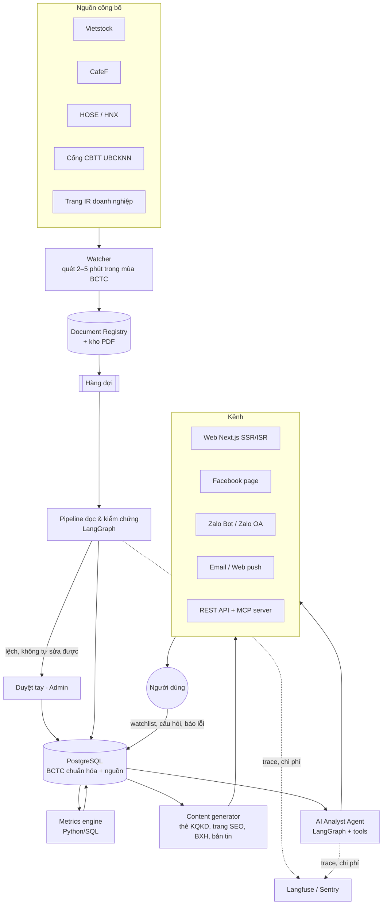
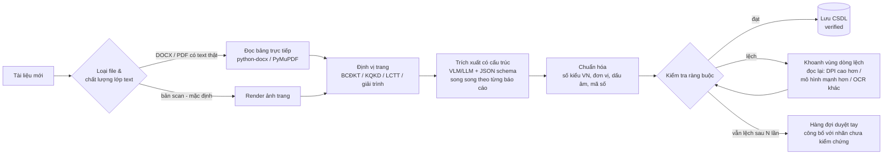
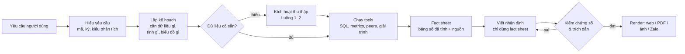

# Kiến trúc kỹ thuật đề xuất

> Tài liệu đi kèm [vision-and-roadmap.md](vision-and-roadmap.md). Mô tả kiến trúc đích (ĐATN) và phần cần làm trước ở Project 3.

## 1. Nguyên tắc thiết kế

1. **Xử lý trước (precompute-first).** Tài liệu được xử lý ngay khi xuất hiện, không đợi đến lúc người dùng hỏi.
2. **Số do code tính, chữ do LLM viết.** LLM không làm toán. Mọi phép tính thực hiện bằng Python/SQL.
3. **Không có nguồn thì không nói.** Mọi con số và mọi khẳng định về nguyên nhân đều có trích dẫn (tài liệu, trang, vùng).
4. **Kiểm chứng xong mới công bố.** Ràng buộc kế toán là cổng chất lượng. Tài liệu không qua được cổng thì gắn nhãn cảnh báo hoặc chuyển duyệt tay.
5. **Workflow tất định bọc quanh các bước agent.** Phần lặp đi lặp lại (thu thập, trích xuất) là pipeline có kiểm soát. Chỉ phần mở (hiểu yêu cầu, lập kế hoạch phân tích) mới để agent tự quyết.
6. **Không khóa vào một nhà cung cấp LLM.** Gọi LLM qua một lớp trung gian (API kiểu OpenAI, LiteLLM hoặc OpenRouter) để đổi mô hình theo chi phí và chất lượng.
7. **Idempotent & có phiên bản.** Mỗi tài liệu được băm nội dung. Mỗi lần trích xuất ghi lại phiên bản pipeline. BCTC điều chỉnh hay công bố lại không ghi đè lên dữ liệu cũ.
8. **Nhiều chế độ kế toán cùng tồn tại.** Từ năm 2026, Thông tư 99/2025 thay Thông tư 200 và đánh lại một số mã số. Ngân hàng, CTCK và bảo hiểm có mẫu riêng. Vì vậy mọi quy tắc (ánh xạ mã, ràng buộc kiểm chứng) đều phải khai báo **theo từng mẫu và phiên bản**, không được hard-code (xem 4.2).

## 2. Tổng thể



## 3. Luồng 1: Thu thập (Watcher → Registry)

- **Nguồn:** bắt đầu từ Vietstock (tái sử dụng logic gọi endpoint danh sách tài liệu trong repo khóa trước). Sau đó bổ sung CafeF, HOSE/HNX và cổng CBTT của UBCKNN để dự phòng và đối chiếu chéo. Ở ĐATN thêm cổng trái phiếu CBIS của HNX.
- **Thiết kế chung cho mọi loại công bố thông tin, không riêng BCTC.** Bộ canh và registry giống nhau cho mọi loại tài liệu. Chỉ bước xử lý phía sau rẽ nhánh theo `doc_type`:
  - BCTC dùng pipeline bảng số ở Luồng 2.
  - Các sự kiện ngắn (giao dịch nội bộ, cổ tức, nghị quyết, nhân sự…) chỉ cần trích xuất một bước thành bản ghi `events`, kèm link về văn bản gốc.
- **Lịch quét:** 2–5 phút/lần trong mùa BCTC (các tuần ngay sau khi kết thúc quý), 30–60 phút/lần ngoài mùa. Ưu tiên các mã có nhiều người theo dõi.
- **Nhận dạng tài liệu:** xác định bộ khóa (mã, loại tài liệu, kỳ, hợp nhất/riêng lẻ, đã kiểm toán/soát xét hay chưa, lần điều chỉnh) bằng luật trên tiêu đề. Chỉ gọi một LLM nhỏ khi tiêu đề mơ hồ.
- **Định dạng file:** ngoài PDF còn gặp DOCX, DOC, ZIP và RAR. Một file nén có thể chứa nhiều báo cáo, ví dụ cả bản hợp nhất lẫn bản riêng lẻ. Bước thu thập phải giải nén và tách thành từng tài liệu.
- **Khử trùng lặp:** băm SHA-256 nội dung file. Nếu cùng khóa nhưng hash khác thì ghi nhận là phiên bản mới (BCTC điều chỉnh).
- **Lưu trữ:** PDF lưu ở object storage (Cloudflare R2, S3 hoặc MinIO). Ghi lại `discovered_at` để đo Time-to-Insight.

## 4. Luồng 2: Đọc & kiểm chứng BCTC



### 4.1 Schema trích xuất: phải đủ các cột (khác biệt then chốt so với bản cũ)

| Báo cáo | Các cột cần lấy |
|---|---|
| KQKD quý | quý này năm nay · quý này năm trước · lũy kế năm nay · lũy kế năm trước |
| BCĐKT | cuối kỳ · đầu năm |
| LCTT | lũy kế năm nay · lũy kế năm trước. BCTC quý thường chỉ có số lũy kế, nên *quý đơn lẻ = lũy kế kỳ này − lũy kế kỳ trước* |

Mỗi dòng lưu: `ma_so`, `ten_chi_tieu` (nguyên văn), `thuyet_minh`, giá trị của từng cột, `trang`, `bbox` (nếu có), `do_tin_cay`.

**Những điều thực tế cần biết** (rút ra khi rà ~1.000 BCTC Q2/2026 đã OCR trong một kho công khai):
- **Bản scan là trường hợp thường gặp**, nên OCR/VLM là đường chính chứ không phải phương án dự phòng.
  - Một số bản scan có lớp text "mỏng" (watermark) khiến phép kiểm tra "có text" trả lời sai.
  - Một số file song ngữ có lớp text tiếng Việt bị lỗi font.
  - → Phải đánh giá **chất lượng** lớp text, không chỉ kiểm tra xem có text hay không.
- **Không phải BCTC nào cũng dùng dấu chấm để phân tách hàng nghìn.** Trong 941 BCTC có dòng "Tổng cộng tài sản", khoảng 3/4 viết `1.234.567`, còn khoảng 1/4 viết `1,234,567`. Phải suy ra dấu phân cách **theo từng tài liệu** (dựa vào nhóm 3 chữ số và phép cộng kiểm tra), không mặc định kiểu châu Âu.
- **Đơn vị** có thể là đồng, nghìn đồng hoặc triệu đồng (ngân hàng thường dùng triệu đồng). Đọc từ dòng "Đơn vị tính" rồi kiểm tra lại bằng độ lớn so với kỳ trước.
- **Cột thuyết minh cũng là số nhỏ**, dễ bị nhầm với cột mã số.

```json
{
  "statement": "IS",
  "unit_detected": "VND",
  "columns": ["q_cur", "q_prev_year", "ytd_cur", "ytd_prev_year"],
  "items": [
    {"code": "10", "label": "Doanh thu thuần về bán hàng và cung cấp dịch vụ",
     "note": "VI.1", "values": {"q_cur": 1.0e12, "q_prev_year": 9.0e11, "ytd_cur": 2.9e12, "ytd_prev_year": 2.6e12},
     "page": 7, "bbox": [72, 210, 540, 224]}
  ]
}
```

*(Số liệu trong ví dụ chỉ mang tính minh họa.)*

### 4.2 Bộ ràng buộc kiểm chứng: khai báo theo mẫu và phiên bản

**Các mẫu BCTC cần hỗ trợ** (đã đối chiếu với BCTC Q2/2026 thực tế):

| Mẫu | Áp dụng cho | Ghi chú |
|---|---|---|
| `TT200` (Thông tư 200/2014, hợp nhất theo TT202) | DN thường, **năm tài chính ≤ 2025** | Dùng cho backfill lịch sử |
| `TT99` (Thông tư 99/2025, hiệu lực 1/1/2026; TT202 được sửa bởi TT43/2026) | DN thường, **từ BCTC Q1/2026** | Đổi một số mã số (bảng dưới). Trong 941 BCTC Q2/2026 đã rà: ~88% ghi mã 280 cho tổng tài sản, ~11% vẫn ghi 270 |
| `TCTD` (TT49/2014/TT-NHNN, sửa bởi TT27/2021) | Ngân hàng | Cấu trúc khác hẳn: "Tổng tài sản có", thu nhập lãi thuần… |
| `CTCK` (TT334/2016) | Công ty chứng khoán | Có tài sản FVTPL, cho vay ký quỹ… |
| `BH` (TT232/2012) | Doanh nghiệp bảo hiểm | Có dự phòng nghiệp vụ… |

**TT200 → TT99: các mã quan trọng bị đổi** (DN thường):

| Chỉ tiêu | TT200 | TT99 |
|---|---|---|
| Tài sản ngắn hạn khác | 150 | 160 (mã 150 mới là tài sản sinh học ngắn hạn) |
| Tài sản dài hạn khác | 260 | 270 (mã 230 mới là tài sản sinh học dài hạn) |
| **Tổng cộng tài sản** | **270** | **280** |
| Tổng cộng nguồn vốn | 440 | 440 (không đổi) |
| Doanh thu hoạt động tài chính / Chi phí tài chính / trong đó: lãi vay | 21 / 22 / 23 | 22 / 23 / 24 (mã 21 mới là lãi/lỗ thanh lý BĐS đầu tư) |
| Doanh thu thuần, LN gộp, LNTT, thuế, LNST, LNST của cổ đông công ty mẹ | 10, 20, 50, 51–52, 60, 61 | Không đổi |

*(Nguồn: văn bản TT99 và các bài hướng dẫn, đối chiếu với BCTC thực tế. Trước khi code, cần đọc lại mẫu biểu gốc trong phụ lục của thông tư.)*

**Ví dụ ràng buộc cho DN thường:**

| Nhóm | TT200 | TT99 |
|---|---|---|
| BCĐKT | **270 = 440**; 270 = 100 + 200; 440 = 300 + 400; 100 = 110 + 120 + 130 + 140 + 150 | **280 = 440**; 280 = 100 + 200; 440 = 300 + 400; các dòng con theo mẫu mới |
| KQKD | 10 = 01 − 02; 20 = 10 − 11; 30 = 20 + (21 − 22) − (25 + 26) (BCTC hợp nhất có thêm phần lãi/lỗ công ty liên doanh, liên kết); 50 = 30 + 40; 60 = 50 − 51 − 52 | 30 = 20 + 21 + 22 − (23 + 25 + 26); các dòng 10, 20, 50, 60 như cũ |
| LCTT | 50 = 20 + 30 + 40; 70 = 50 + 60 + 61 | Như cũ (cần xác nhận lại trên mẫu gốc) |

**Ràng buộc chung cho mọi mẫu:**

| Nhóm | Ràng buộc |
|---|---|
| Chéo báo cáo | Tiền cuối kỳ trên LCTT = tiền và tương đương tiền trên BCĐKT; tiền đầu kỳ trên LCTT = số đầu năm |
| Chéo kỳ | "Đầu năm" trên BCĐKT = "cuối kỳ" của BCTC năm trước; lũy kế Q3 − lũy kế Q2 = quý 3. Lưu ý: năm chuyển đổi sang TT99 có thể có điều chỉnh số liệu so sánh |
| Hợp lý | Dấu của chi phí và giảm trừ; đơn vị; độ lớn so với kỳ trước (chênh khoảng 1.000 lần là dấu hiệu nhầm đơn vị) |

**Những điểm cần lưu ý khi cài đặt:**
- **BCTC thực tế không luôn theo đúng mẫu.** Ví dụ có file in "(270 = 100 + 200)" ngay cạnh mã 280, có file ghi 270 cho dòng tổng theo mẫu mới, có file vẫn dùng mã KQKD cũ. → Nhận dạng mẫu bằng **cả ba tín hiệu**: tên chỉ tiêu, mã số và phép cộng kiểm tra. Mỗi tài liệu được gắn `template_ver`. Không suy mẫu chỉ từ năm.
- **Ngân hàng:** ràng buộc tương tự nhưng theo cấu trúc riêng. Ví dụ: thu nhập lãi thuần = thu nhập lãi − chi phí lãi; LNTT = LN trước dự phòng − chi phí dự phòng; tổng tài sản = tổng nợ phải trả + vốn chủ sở hữu…
- **Sai số cho phép:** ±1 đơn vị làm tròn cho mỗi số hạng.
- **Bảng mã chuẩn hóa xuyên mẫu** (`canonical`, mục 5) giúp so sánh được giữa các năm (TT200 ↔ TT99) và giữa các công ty. Đây là một tài sản dữ liệu quan trọng, đồng thời là điểm cộng kỹ thuật cho đồ án.

### 4.3 Thang leo thang khi số liệu lệch

1. Đọc lại đúng trang đó ở DPI cao hơn, chỉ cho các dòng lệch. Prompt nói rõ *"dòng X đang lệch Y"*.
2. Dùng mô hình mạnh hơn cho trang đó.
3. Dùng engine khác (OCR truyền thống hoặc Hybrid OCR của khóa trước), sau đó để LLM ghép kết quả.
4. Duyệt tay: admin xem PDF đặt cạnh bảng số, sửa và lưu. Dữ liệu sửa tay trở thành **dữ liệu vàng** cho việc đánh giá.

### 4.4 Chọn mô hình

- **Ứng viên cần benchmark:**
  - VLM đa năng, giá rẻ, hỗ trợ ảnh và JSON schema (ví dụ họ Gemini Flash/Flash-Lite như khóa trước đã dùng, hoặc mô hình tương đương của nhà cung cấp khác).
  - Dịch vụ OCR tài liệu chuyên dụng (ví dụ Mistral OCR, mà một dự án tương tự đã chuyển sang dùng vì chính xác hơn và rẻ hơn).
  - Mô hình OCR/VLM mã nguồn mở.
  - Dùng mô hình mạnh hơn cho bước đọc lại.
- **Tiêu chí chọn:** *tỷ lệ vượt kiểm tra ràng buộc* và độ chính xác trên golden set, đặt cạnh chi phí và độ trễ. Đo bằng script đánh giá, không chọn theo cảm tính.
- **Dự phòng dài hạn:** tự host mô hình OCR/VLM mã nguồn mở khi lưu lượng lớn.
- **Tham chiếu chi phí:** khóa trước đo được khoảng $0,04 cho mỗi báo cáo khi gửi toàn bộ markdown nhiều lần. Nếu chỉ gửi 5–10 trang cần thiết thì chi phí sẽ giảm đáng kể, nhưng cần đo lại trên thực tế.

## 5. Mô hình dữ liệu (phác thảo)

```sql
-- Danh mục công ty
CREATE TABLE companies (
  ticker        VARCHAR(10) PRIMARY KEY,
  name          TEXT NOT NULL,
  exchange      VARCHAR(10),            -- HOSE / HNX / UPCOM
  industry_code VARCHAR(20),            -- ICB
  template      VARCHAR(20) NOT NULL    -- corporate / bank / securities / insurance
);

-- Tài liệu gốc
CREATE TABLE documents (
  id             BIGSERIAL PRIMARY KEY,
  ticker         VARCHAR(10) REFERENCES companies,
  doc_type       VARCHAR(30),   -- fs_quarter / fs_semiannual / fs_annual / profit_explanation / agm_resolution
  fiscal_year    INT,
  fiscal_period  VARCHAR(4),    -- Q1..Q4 / H1 / FY
  scope          VARCHAR(12),   -- consolidated / separate
  audit_status   VARCHAR(12),   -- none / reviewed / audited
  template_ver   VARCHAR(12),   -- TT200 / TT99 / TCTD / CTCK / BH (nhận dạng từ nội dung, không suy từ năm)
  source_url     TEXT,
  storage_key    TEXT,
  sha256         CHAR(64) UNIQUE,
  published_at   TIMESTAMPTZ,
  discovered_at  TIMESTAMPTZ DEFAULT now(),
  status         VARCHAR(20)    -- queued / extracting / verified / needs_review / failed
);

-- Một dòng = một ô số trong BCTC
CREATE TABLE line_items (
  id            BIGSERIAL PRIMARY KEY,
  document_id   BIGINT REFERENCES documents ON DELETE CASCADE,
  statement     VARCHAR(3),     -- BS / IS / CF
  code          VARCHAR(10),    -- mã số in trên BCTC
  canonical     VARCHAR(40),    -- mã chuẩn hóa nội bộ (theo mẫu + phiên bản)
  label_raw     TEXT,
  column_kind   VARCHAR(20),    -- q_cur / q_prev_year / ytd_cur / ytd_prev_year / end_period / begin_year
  value         NUMERIC(24,2),  -- đã quy đổi về đồng
  page          INT,
  bbox          JSONB,
  method        VARCHAR(30),    -- text_layer / vlm / ocr / manual
  pipeline_ver  VARCHAR(20)
);

-- Kết quả kiểm chứng
CREATE TABLE validations (
  document_id BIGINT REFERENCES documents ON DELETE CASCADE,
  rule_id     VARCHAR(40),
  passed      BOOLEAN,
  lhs         NUMERIC,
  rhs         NUMERIC,
  details     JSONB
);

-- Chỉ số tính sẵn
CREATE TABLE metrics (
  ticker      VARCHAR(10),
  period      VARCHAR(10),      -- 2026Q3, 2026TTM, ...
  metric      VARCHAR(40),
  value       NUMERIC,
  formula_ver VARCHAR(10),
  PRIMARY KEY (ticker, period, metric)
);

-- Kế hoạch năm (ĐHCĐ)
CREATE TABLE annual_plans (
  ticker          VARCHAR(10),
  year            INT,
  revenue         NUMERIC,
  npat            NUMERIC,
  source_document BIGINT REFERENCES documents,
  PRIMARY KEY (ticker, year)
);

-- Báo cáo AI đã sinh (cache + truy vết)
CREATE TABLE reports (
  id         UUID PRIMARY KEY,
  kind       VARCHAR(30),       -- company_quarter / compare / sector / trend / health
  params     JSONB,
  content    JSONB,
  created_at TIMESTAMPTZ DEFAULT now(),
  model      VARCHAR(60),
  cost_usd   NUMERIC,
  verified   BOOLEAN
);

-- Sự kiện công bố thông tin (ngoài BCTC)
CREATE TABLE events (
  id           BIGSERIAL PRIMARY KEY,
  document_id  BIGINT REFERENCES documents ON DELETE CASCADE,
  ticker       VARCHAR(10) REFERENCES companies,
  event_type   VARCHAR(30),   -- insider_trade_plan / insider_trade_result / major_holder / dividend / agm_resolution / issuance / personnel / penalty / audit_opinion / bond_payment
  event_date   DATE,          -- ngày hiệu lực: ngày GDKHQ, ngày bắt đầu giao dịch, …
  payload      JSONB,         -- trường có cấu trúc theo từng loại: người giao dịch, số lượng, tỷ lệ, …
  materiality  SMALLINT,      -- mức độ quan trọng, dùng để quyết định có gửi cảnh báo không
  source_page  INT
);

-- Người dùng, watchlist, phản hồi, text chunk (pgvector) cho giải trình/thuyết minh: bổ sung sau
```

## 6. Metrics engine

- **Doanh nghiệp thường:** doanh thu thuần, LN gộp, biên LN gộp, biên LN ròng, LNST của cổ đông công ty mẹ; tăng trưởng YoY, QoQ và lũy kế; TTM; ROE/ROA (TTM, trên bình quân); nợ vay/VCSH; dòng tiền kinh doanh/LNST; vòng quay phải thu và tồn kho; % hoàn thành kế hoạch năm.
- **Ngân hàng:** thu nhập lãi thuần, thu nhập ngoài lãi và tỷ trọng của nó, CIR, chi phí dự phòng, LN trước dự phòng, tăng trưởng cho vay và tiền gửi khách hàng (so với đầu năm), LDR (xấp xỉ). Nợ xấu và tỷ lệ bao phủ nợ xấu lấy từ thuyết minh (để ĐATN).
- Mỗi chỉ số có định nghĩa, công thức và phiên bản. Người dùng xem được mục "cách tính", nhờ vậy kết quả minh bạch.

## 7. AI Analyst Agent



| Tool | Chức năng |
|---|---|
| `get_statement(ticker, period, statement, scope)` | Lấy BCTC đã chuẩn hóa |
| `get_metrics(tickers, periods, metrics)` | Lấy chỉ số đã tính sẵn |
| `find_peers(ticker, n)` | Chọn nhóm so sánh theo ngành và quy mô |
| `get_explanations(ticker, period)` | Lấy nguyên nhân từ công văn giải trình/thuyết minh (RAG, kèm trích dẫn) |
| `get_plan(ticker, year)` | Lấy kế hoạch năm từ ĐHCĐ |
| `make_chart(spec)` | Sinh biểu đồ (spec ECharts/Vega-Lite) |
| `request_ingestion(ticker, period)` | Yêu cầu thu thập khi thiếu dữ liệu |

**Bộ kiểm chứng số (numeric faithfulness guard):**
1. Trích mọi con số trong văn bản sinh ra (kèm đơn vị và %).
2. Khớp từng số với fact sheet (có dung sai làm tròn).
3. Kiểm tra từ chỉ chiều ("tăng"/"giảm", "vượt"/"hụt") có khớp dấu của dữ liệu không.
4. Số nào không khớp thì viết lại kèm phản hồi, hoặc bỏ câu đó.
5. Ghi log tỷ lệ vi phạm để đánh giá.

**Cache:** báo cáo chuẩn (mỗi mã × mỗi quý) được sinh sẵn ngay khi dữ liệu về. Báo cáo tùy biến được cache theo hash của tham số + phiên bản dữ liệu.

## 8. Kênh

- **Web:** Next.js (SSR/ISR) để làm SEO.
  - Trang mã `/{ticker}`, trang quý `/{ticker}/q3-2026`, trang mùa `/mua-bctc/q3-2026`, trang ngành.
  - Ảnh OG tự sinh cho mỗi thẻ, sitemap, schema.org, thiết kế ưu tiên di động.
- **Minh bạch AI (theo Luật Trí tuệ nhân tạo):** gắn nhãn "Nội dung do AI tạo" trên mọi nhận định; thông báo rõ khi người dùng đang chat với AI; có trang phương pháp.
- **Không có ngôn ngữ khuyến nghị:** prompt cấm và bộ lọc từ khóa chặn các cụm "nên mua", "nên bán", "giá mục tiêu", "khuyến nghị"…
- **Zalo Bot (P3):** dùng Zalo Bot Platform, tạo từ tài khoản cá nhân, API kiểu Telegram (webhook/polling), miễn phí khi đang beta. Hỗ trợ lệnh tra mã, theo dõi mã, nhận cảnh báo.
- **Zalo OA / Mini App (ĐATN):** Open API cần gói Growth và OA của tổ chức đã xác thực (có thể qua lab). Mini App cần eKYC.
- **Facebook page:** đăng thẻ KQKD, BXH mỗi tối. Dùng Graph API để tự động hóa nếu đủ điều kiện, nếu không thì đăng bán tự động.
- **Telegram:** chỉ là kênh phụ, vì đang bị chặn tại Việt Nam từ 5/2025.
- **MCP server + app trong ChatGPT và các trợ lý AI khác:** thử nghiệm ở cuối P3, hoàn thiện và nộp app ở ĐATN. Đây là câu trả lời trực tiếp cho câu hỏi "tại sao không dùng ChatGPT".
  - **Các tool (chỉ đọc):**
    - `get_statement(ticker, period)`, `get_metrics(tickers, periods, metrics)`;
    - `screen(conditions)`: lọc trên toàn thị trường;
    - `list_events(ticker, types, since)`;
    - `verify_claim(ticker, claim)`: trả về đúng/sai kèm nguồn.
  - **Kết quả trả về:** mọi tool trả về số liệu kèm `source_url`, trang và trạng thái kiểm chứng. Nhờ vậy các trợ lý AI trích nguồn được, thay vì tự đoán.
  - **Hạ tầng:** OAuth để đếm người dùng duy nhất; rate limit; ghi log truy vấn (ẩn danh) để biết người dùng thật sự hỏi gì.
  - **Nộp app:** thư mục ứng dụng của ChatGPT yêu cầu có website đã xác thực, chính sách quyền riêng tư, điều khoản sử dụng và MCP server, nên cần chuẩn bị sớm.
- **REST API công khai:** để ĐATN. Có API key và rate limit.
- **Vì sao không dùng Streamlit cho trang công khai:** Streamlit phù hợp làm demo hoặc công cụ nội bộ (có thể giữ lại làm trang duyệt tay), nhưng không hợp với trang công khai cần SEO, cần chia sẻ và phục vụ nhiều người.

## 9. Hạ tầng & vận hành (ưu tiên rẻ, đơn giản)

| Thành phần | Lựa chọn gợi ý |
|---|---|
| Backend | Python 3.12, FastAPI, LangGraph, Pydantic, SQLAlchemy |
| Hàng đợi | Redis + Arq/Celery, hoặc hàng đợi trên PostgreSQL để bớt thành phần |
| CSDL | PostgreSQL 16 + pgvector |
| Lưu file | Cloudflare R2 hoặc S3-compatible |
| Frontend | Next.js + Tailwind + thư viện biểu đồ (ECharts/Recharts) |
| Triển khai | Docker Compose trên 1 VPS (giai đoạn đầu) + Cloudflare CDN. Frontend đặt trên Vercel/Cloudflare Pages. CI/CD bằng GitHub Actions |
| Quan sát | Langfuse (trace và chi phí LLM), Sentry (lỗi), Uptime Kuma (uptime) |
| Analytics | GA4 hoặc PostHog/Umami, kèm Google Search Console |

## 10. Kế hoạch đánh giá

| Khía cạnh | Thước đo | Cách đo |
|---|---|---|
| Đọc số liệu | Number F1, CER, Word Recall | Chạy lại benchmark vnpdf của khóa trước, so sánh trực tiếp với Tesseract / Hybrid / Marker |
| Độ chính xác từng trường | Accuracy theo (mã số, cột) | Golden set gồm 50–100 BCTC duyệt tay, đủ các ngành |
| Kiểm chứng | % tài liệu vượt toàn bộ ràng buộc; % lỗi tự sửa được | Log của pipeline |
| Nhận định AI | % số liệu không khớp fact sheet (trước và sau verifier); điểm chấm của người đọc theo rubric | Tự động, cộng thêm 5–10 người chấm (sinh viên tài chính) |
| Tốc độ | Time-to-Insight p50/p95; thời gian tạo báo cáo | Log |
| Chi phí | $/tài liệu, $/báo cáo, $/người dùng | Langfuse |
| **So với trợ lý AI đa năng ("ChatGPT test")** | Tỷ lệ đúng số (sai số ≤ 0,5%), độ mới (hỏi ngay sau công bố), khả năng trả lời câu hỏi toàn thị trường, có nguồn kiểm chứng được hay không, thời gian, chi phí | 50–100 câu hỏi thật chia 5 loại. Chạy trên ChatGPT/Gemini/Perplexity (có tìm web) và trên Soi. Lặp lại sau mỗi mùa BCTC với phiên bản mô hình mới nhất |
| Sản phẩm | UV, MAU, WAU, retention theo cohort, lượt chia sẻ, CSAT; người dùng và lượt gọi qua MCP | Analytics, log MCP |

## 11. Cấu trúc repo đề xuất

```
stock-agent/
├── apps/
│   ├── web/                # Next.js: trang công khai, SEO, giao diện chat
│   └── admin/              # Duyệt tay (có thể dùng Streamlit)
├── services/
│   ├── ingestion/          # watcher, registry, downloader
│   ├── extraction/         # pipeline LangGraph đọc & kiểm chứng
│   │   ├── schemas/        # Pydantic schema theo từng mẫu BCTC
│   │   └── rules/          # ràng buộc kế toán theo mẫu (DN thường, ngân hàng, …)
│   ├── metrics/            # tính chỉ số
│   ├── analyst/            # AI Analyst agent + tools + verifier
│   ├── content/            # thẻ KQKD, BXH, bản tin
│   ├── bots/               # Zalo Bot (sau: Zalo OA), Facebook; Telegram tùy chọn
│   ├── events/             # trích xuất sự kiện công bố thông tin ngắn (ĐATN)
│   ├── mcp/                # MCP server cho ChatGPT và các trợ lý AI khác (thử ở cuối P3)
│   └── api/                # FastAPI: REST API công khai
├── db/migrations/
├── eval/                   # benchmark vnpdf, golden set, đánh giá nhận định
│   └── chatgpt_test/       # bộ câu hỏi, câu trả lời, điểm chấm theo từng mùa
├── infra/                  # docker-compose, CI/CD
└── docs/
```
